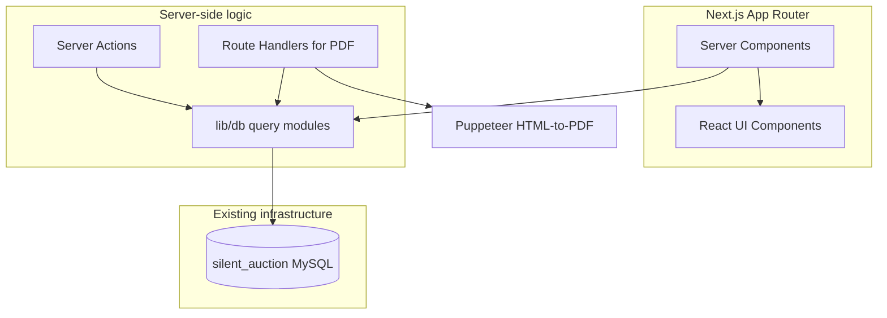

# Conversation Log — `r0-m2-s1-nextjs`

| Field            | Value             |
| ---------------- | ----------------- |
| Migration (cell) | `r0-m2-s1-nextjs` |
| Date             | 2026/07/01        |

## Conversation

**Timing (wall-clock):**

- complete run: _00:11:53.03_
  > This should encompass recorded time per prompt, as well as invested time by the developer in between prompts.

### Prompt 1

**Starting condition:** None/Cold

**Mode:** `Plan`

**Prompt:** Migrate the php application at @original-php-project/ to Next.js (App Router) using bun. Produce a full-stack implementation — frontend and backend — that is a working application equivalent to the existing one, using the existing database per the provided schema (do not modify the database). Plan the migration of the current app's functionality. The migrated code lives in @migrated-project, @original-php-project/ stays and remains unaltered.

---

#### Plan creation

**Duration:** _00:02:26.75_

**Created plan:**

````md
---
name: PHP to Next.js Migration
overview: Scaffold a Bun-powered Next.js App Router application in `migrated-project/` that replicates all 22 functional pages of the Taylor Elementary PTA Silent Auction PHP app, connecting to the existing `silent_auction` MySQL database without schema changes.
todos:
  - id: scaffold
    content: Scaffold Next.js App Router project in migrated-project/ with Bun, mysql2, zod, puppeteer; configure .env.local and db pool
    status: pending
  - id: layout-css
    content: Port global.css and build root layout (Header, Footer, MainNav, FlashMessages, Subnav components)
    status: pending
  - id: data-layer
    content: Implement lib/db/* TypeScript modules mirroring all db_*.php query functions with PascalCase table names
    status: pending
  - id: donors-module
    content: Build all donor routes, Server Actions, validation, and PDF endpoints (letters + tax receipts)
    status: pending
  - id: lots-module
    content: Build categories, lots, items CRUD pages, bulk lot assignment, lot details, bidding sheet PDF
    status: pending
  - id: auction-polish
    content: Build auction catalog page, copy logo asset, verify full route parity and flash messages
    status: pending
isProject: false
---

# PHP Silent Auction → Next.js (App Router + Bun) Migration Plan

## Source and target

|                        | Path                                                                                         | Status                                                                                                                    |
| ---------------------- | -------------------------------------------------------------------------------------------- | ------------------------------------------------------------------------------------------------------------------------- |
| **Source (read-only)** | [`original-php-project/silent_auction_merged/`](original-php-project/silent_auction_merged/) | Fully implemented procedural PHP + PDO + Dompdf                                                                           |
| **Target**             | [`migrated-project/`](migrated-project/)                                                     | Empty (only `temp.txt` placeholder)                                                                                       |
| **Database**           | `silent_auction` on `localhost:3306`                                                         | Frozen schema per [`.cursor/rules/database-schema.mdc`](.cursor/rules/database-schema.mdc) — data read/write only, no DDL |

## Application scope

Taylor Elementary PTA **Silent Auction Management** — back-office CRUD for donors, items, lots, and categories, plus a public auction catalog and three PDF exports. **No authentication** in the PHP app; the Next.js port matches that (all routes publicly accessible).

**In scope (22 PHP pages):** Home, Donors (8 pages + 2 PDF endpoints), Lots (11 pages + 1 PDF endpoint), Auction catalog.

**Out of scope (match PHP):**

- `bidders/index.php` stub ("not yet implemented") — omit from nav; optional `/bidders` stub page only if parity harness expects it
- `Bid` table — exists in schema but unused by PHP
- Database schema changes, seed scripts, or migrations



---

## Tech stack

| Concern                   | Choice                                                                                                 | Rationale                                                                                                                                                                                                          |
| ------------------------- | ------------------------------------------------------------------------------------------------------ | ------------------------------------------------------------------------------------------------------------------------------------------------------------------------------------------------------------------ |
| Runtime / package manager | **Bun**                                                                                                | User requirement; `bun create next-app`, `bun dev`, `bun install`                                                                                                                                                  |
| Framework                 | **Next.js 15 App Router** + TypeScript                                                                 | Full-stack SSR/RSC equivalent to PHP page rendering                                                                                                                                                                |
| Database client           | **`mysql2`** connection pool                                                                           | Closest to PHP PDO; no ORM migration needed; use PascalCase table names from schema rule                                                                                                                           |
| Validation                | **Zod**                                                                                                | Port rules from `includes/ui/form_*.php`                                                                                                                                                                           |
| PDF generation            | **Puppeteer** rendering ported HTML templates                                                          | Dompdf equivalent; preserves layout from [`templates/`](original-php-project/silent_auction_merged/templates/) and [`utils/bidding_sheet.php`](original-php-project/silent_auction_merged/utils/bidding_sheet.php) |
| Styling                   | Port [`css/global.css`](original-php-project/silent_auction_merged/css/global.css) → `app/globals.css` | Same BEM/ITCSS design system, no Tailwind unless needed for minor gaps                                                                                                                                             |
| Forms / mutations         | **Server Actions** + `redirect()` + query-param flash messages                                         | Functional equivalent to PHP GET-form submits; avoids exposing PII in URLs (improvement over PHP while preserving UX)                                                                                              |

**Environment** (`.env.local`):

```
DATABASE_HOST=localhost
DATABASE_PORT=3306
DATABASE_USER=root
DATABASE_PASSWORD=MysqlEragon44!
DATABASE_NAME=silent_auction
```

---

## Project scaffold

```bash
cd migrated-project
bun create next-app . --typescript --app --no-tailwind --import-alias "@/*"
bun add mysql2 zod puppeteer
bun add -d @types/node
```

Remove `temp.txt`. Copy PTA logo to `public/assets/Tiger-icon-hi-res.webp` (referenced in header and tax receipts; asset folder is empty in source but path is hard-coded).

**Suggested directory layout:**

```
migrated-project/
├── app/
│   ├── layout.tsx              # Root layout: header, nav, footer
│   ├── page.tsx                # Home module hub
│   ├── globals.css             # Port of global.css
│   ├── donors/…                # Donor routes
│   ├── lots/…                  # Lots routes
│   ├── auction/page.tsx        # Public catalog
│   └── api/pdf/…               # PDF Route Handlers (POST/GET)
├── components/
│   ├── layout/                 # Header, Footer, MainNav, Subnav, FlashMessages
│   ├── ui/                     # FormField, DataTable, ActionLinks, ConfirmDelete, …
│   └── pdf/                    # HTML template builders for PDF
├── lib/
│   ├── db/
│   │   ├── pool.ts             # mysql2 pool singleton
│   │   ├── donors.ts           # ← db_donors.php
│   │   ├── items.ts            # ← db_items.php
│   │   ├── lots.ts             # ← db_lots.php
│   │   ├── categories.ts       # ← db_categories.php
│   │   └── auction.ts          # ← db_auction.php
│   ├── validation/             # donor, item, lot, category schemas
│   ├── pdf/render.ts           # Puppeteer wrapper (stream PDF response)
│   └── flash.ts                # success/error message map from flash_messages.php
```

---

## Route mapping (PHP → Next.js)

### Home

| PHP         | Next.js        |
| ----------- | -------------- |
| `index.php` | `app/page.tsx` |

### Donors module

Subnav tabs: All Donors | Pending Receipts | Letters | Tax Receipts

| PHP                           | Next.js                                | Notes                                                             |
| ----------------------------- | -------------------------------------- | ----------------------------------------------------------------- |
| `donors/index.php`            | `app/donors/page.tsx`                  | List with Edit/Delete; flash via `?success=` / `?error=`          |
| `donors/edit_donor.php`       | `app/donors/edit/page.tsx`             | `?DonorID=` for edit; Server Action for create/update             |
| `donors/delete_donor.php`     | `app/donors/delete/page.tsx`           | Confirm screen; block if `donor_has_items()`                      |
| `donors/pending_receipts.php` | `app/donors/pending-receipts/page.tsx` | Read-only aggregate report                                        |
| `donors/letters.php`          | `app/donors/letters/page.tsx`          | Checkbox selection form                                           |
| `donors/letters_print.php`    | `app/api/pdf/letters/route.ts`         | POST `donorIds[]` → PDF download                                  |
| `donors/receipts.php`         | `app/donors/receipts/page.tsx`         | Checkbox selection form                                           |
| `donors/receipts_print.php`   | `app/api/pdf/receipts/route.ts`        | POST → PDF + `mark_receipt_sent()` per donor **before** streaming |

### Lots module

Subnav tabs: Items | Lots | Categories

| PHP                        | Next.js                              | Notes                                                                         |
| -------------------------- | ------------------------------------ | ----------------------------------------------------------------------------- |
| `lots/index.php`           | `app/lots/page.tsx`                  | Redirect to `/lots/items`                                                     |
| `lots/items.php`           | `app/lots/items/page.tsx`            | Table + inline lot dropdowns; Server Action for bulk `modify_items()`         |
| `lots/edit_item.php`       | `app/lots/edit-item/page.tsx`        | Add/edit item                                                                 |
| `lots/delete_item.php`     | `app/lots/delete-item/page.tsx`      | Confirm delete                                                                |
| `lots/bidding_sheet.php`   | `app/api/pdf/bidding-sheet/route.ts` | GET `ItemID`, optional `startingBid`, `bidIncrement`, `rows`                  |
| `lots/lots.php`            | `app/lots/lots/page.tsx`             | Lot list with winner/category                                                 |
| `lots/edit_lot.php`        | `app/lots/edit-lot/page.tsx`         | Category + bidder dropdowns                                                   |
| `lots/delete_lot.php`      | `app/lots/delete-lot/page.tsx`       | Confirm delete                                                                |
| `lots/lot_details.php`     | `app/lots/lot-details/page.tsx`      | Read-only detail; **fix**: join bidder name (PHP bug: `get_lot()` lacks join) |
| `lots/categories.php`      | `app/lots/categories/page.tsx`       | Category list                                                                 |
| `lots/edit_category.php`   | `app/lots/edit-category/page.tsx`    | Add/edit                                                                      |
| `lots/delete_category.php` | `app/lots/delete-category/page.tsx`  | Confirm delete                                                                |

### Auction

| PHP                 | Next.js                |
| ------------------- | ---------------------- | ---------------------------------------------------------- |
| `auction/index.php` | `app/auction/page.tsx` | Items grouped by category via `item → lot → category` join |

---

## Data layer port

Translate each function in [`data/db_*.php`](original-php-project/silent_auction_merged/data/) to typed TypeScript modules using `mysql2/promise`. Use **PascalCase table names** (`Donor`, `Item`, `Lot`, `Category`, `Bidder`) per schema rule; MySQL on Windows is case-insensitive so this works with existing data.

**Key queries to preserve exactly:**

- **Donors:** `get_donors_without_receipt` SQL aggregate; `get_donors_eligible_for_receipt` PHP loop filter; `donor_has_items` guard on delete; `mark_receipt_sent` on receipt PDF
- **Items:** Two-query sort (NULL `LotID` first, then assigned); `modify_items` batch `CASE`/`UPDATE`; `-1` lot value → `NULL`
- **Lots:** `get_lots()` joins `Bidder` + `Category`; `get_bidders()` read-only for lot form dropdown
- **Auction:** `get_items()` + `get_category_descriptions()` bucketed by `CategoryID`

**Types:** Define interfaces matching DB columns (`Donor`, `Item`, `Lot`, etc.) in `lib/db/types.ts`.

**Connection:** Single pool in `lib/db/pool.ts`; no ro/rw/fc tier split needed (PHP env uses same credentials for all modes).

---

## UI component port

Map PHP `includes/ui/*.php` helpers to React Server/Client components:

| PHP helper                              | React component                                                      |
| --------------------------------------- | -------------------------------------------------------------------- |
| `render_header` / `render_footer`       | `components/layout/Header.tsx`, `Footer.tsx`                         |
| `render_subnav` + module subnavs        | `components/layout/Subnav.tsx`, `DonorsSubnav.tsx`, `LotsSubnav.tsx` |
| `render_flash_messages`                 | `components/layout/FlashMessages.tsx` (reads `searchParams`)         |
| `form_field`, `form_actions`            | `FormField.tsx`, `FormActions.tsx`                                   |
| `table`, `table_donors`, `table_shell`  | `DataTable.tsx`, `DonorsTable.tsx`, `ItemsTable.tsx`, …              |
| `select`, `select_lot`, `select_donors` | `Select.tsx`, `LotSelect.tsx`, `DonorCheckboxTable.tsx`              |
| `confirm_delete`                        | `ConfirmDelete.tsx`                                                  |
| `action_links`, `button`                | `ActionLinks.tsx`, `Button.tsx`                                      |
| `auction_category`, `auction_item`      | `AuctionCategory.tsx`, `AuctionItem.tsx`                             |
| `lot_details`, `detail_field`           | `LotDetails.tsx`, `DetailField.tsx`                                  |
| `empty_state`, `page_intro`             | `EmptyState.tsx`, `PageIntro.tsx`                                    |

**Items page lot-assignment:** Requires a Client Component wrapper for the `<select>` dropdowns inside a `<form>` posting to a Server Action (only interactive page in the PHP app besides checkbox PDF forms).

**Active nav state:** Derive from `usePathname()` in a small Client Component nav, mirroring [`includes/header.php`](original-php-project/silent_auction_merged/includes/header.php) section detection.

---

## Validation rules (from PHP forms)

Port to Zod schemas in `lib/validation/`:

- **Donor** ([`form_donors.php`](original-php-project/silent_auction_merged/includes/ui/form_donors.php)): ContactName required; field max lengths; email format; zip numeric; TaxReceipt checkbox on edit only
- **Item** ([`form_items.php`](original-php-project/silent_auction_merged/includes/ui/form_items.php)): Description required; RetailValue numeric; DonorID required
- **Lot** ([`form_lots.php`](original-php-project/silent_auction_merged/includes/ui/form_lots.php)): Description required (≤75 per DB, PHP validates 255 — use DB limit 75); optional WinningBid numeric ≥0; Image URL http(s) validation
- **Category** ([`form_categories.php`](original-php-project/silent_auction_merged/includes/ui/form_categories.php)): Description required, max 75

---

## PDF generation

Three PDF endpoints, matching PHP behavior:

1. **Donor letters** — multi-page solicitation letters from [`templates/donors_letters.php`](original-php-project/silent_auction_merged/templates/donors_letters.php)
2. **Tax receipts** — from [`templates/tax_receipts.php`](original-php-project/silent_auction_merged/templates/tax_receipts.php); embed logo via absolute file path; **side effect:** set `TaxReceipt = 1` before PDF response (same as PHP)
3. **Bidding sheet** — from [`utils/bidding_sheet.php`](original-php-project/silent_auction_merged/utils/bidding_sheet.php); defaults: starting bid = 50% retail or $10, increment $5, 15 rows

**Implementation:**

- Build HTML strings via TS template functions in `components/pdf/` (port inline CSS from PHP templates)
- `lib/pdf/render.ts`: Puppeteer `page.setContent(html)` → `page.pdf({ format: 'letter' })` → return `Response` with `Content-Type: application/pdf` and `Content-Disposition: attachment`
- Route Handlers validate input, fetch data, call renderer

---

## Business logic parity checklist

- Donor delete blocked when items exist → redirect `?error=has_items`
- Tax receipt eligibility: donors with items and `TaxReceipt = 0`
- Item list ordering: unassigned (`LotID IS NULL`) before assigned
- Bulk lot reassignment: only changed rows; `-1` means unassign
- Bidding sheet: redirect to items if invalid/missing `ItemID`
- Flash message keys: mirror [`flash_messages.php`](original-php-project/silent_auction_merged/includes/flash_messages.php) exactly
- `donor_display_name()`: BusinessName if set, else ContactName

---

## Implementation phases

### Phase 1 — Foundation

- Scaffold Next.js with Bun; configure `.env.local` and `lib/db/pool.ts`
- Port `globals.css`; build root layout (header, main nav, footer)
- Implement `lib/db/types.ts` and all query modules
- Home page with module links

### Phase 2 — Donors module

- All donor pages + subnav + flash messages
- Donor CRUD Server Actions with validation
- Pending receipts report
- Letters/receipts selection pages + PDF Route Handlers

### Phase 3 — Lots module

- Categories CRUD
- Lots CRUD + lot details (with bidder name join)
- Items CRUD + bulk lot assignment
- Bidding sheet PDF

### Phase 4 — Auction + polish

- Public auction catalog page
- Copy logo asset; verify all nav links and subnav active states
- End-to-end manual test against live `silent_auction` database

---

## Verification

Manual test matrix covering every PHP route:

1. CRUD each entity (donor, item, lot, category) — create, edit, delete (including blocked donor delete)
2. Bulk lot reassignment on items page
3. Generate all three PDF types; confirm tax receipt sets `TaxReceipt = 1`
4. Auction page shows items grouped by category
5. Flash messages appear for all success/error codes
6. Run `bun dev` and confirm app serves on default port

No PHPUnit port required (PHP tests cover UI string helpers only, not DB integration).

---

## Key source files to reference during implementation

| Area             | Primary PHP sources                                                                                                                                                                                                                                                                                                                                                                                                               |
| ---------------- | --------------------------------------------------------------------------------------------------------------------------------------------------------------------------------------------------------------------------------------------------------------------------------------------------------------------------------------------------------------------------------------------------------------------------------- |
| Data access      | [`data/db_donors.php`](original-php-project/silent_auction_merged/data/db_donors.php), [`db_items.php`](original-php-project/silent_auction_merged/data/db_items.php), [`db_lots.php`](original-php-project/silent_auction_merged/data/db_lots.php), [`db_categories.php`](original-php-project/silent_auction_merged/data/db_categories.php), [`db_auction.php`](original-php-project/silent_auction_merged/data/db_auction.php) |
| Layout           | [`includes/header.php`](original-php-project/silent_auction_merged/includes/header.php), [`page_layout.php`](original-php-project/silent_auction_merged/includes/page_layout.php)                                                                                                                                                                                                                                                 |
| Forms/validation | [`includes/ui/form_*.php`](original-php-project/silent_auction_merged/includes/ui/)                                                                                                                                                                                                                                                                                                                                               |
| PDF              | [`includes/utils/pdf.php`](original-php-project/silent_auction_merged/includes/utils/pdf.php), [`templates/`](original-php-project/silent_auction_merged/templates/)                                                                                                                                                                                                                                                              |
| Styles           | [`css/global.css`](original-php-project/silent_auction_merged/css/global.css)                                                                                                                                                                                                                                                                                                                                                     |
````

#### Plan execution

**Duration:** _00:09:26.28_

**Reply:**

````md
The PHP Silent Auction app is migrated to Next.js in `migrated-project/`. Summary:

## What was built

**Stack:** Next.js 16 App Router, Bun, mysql2, Zod, Puppeteer (PDFs)

**Routes (22 pages + 3 PDF endpoints):**

| Module  | Routes                                                                                                         |
| ------- | -------------------------------------------------------------------------------------------------------------- |
| Home    | `/`                                                                                                            |
| Donors  | `/donors`, `/donors/edit`, `/donors/delete`, `/donors/pending-receipts`, `/donors/letters`, `/donors/receipts` |
| PDF     | `/api/pdf/letters`, `/api/pdf/receipts`, `/api/pdf/bidding-sheet`                                              |
| Lots    | `/lots/items`, `/lots/lots`, `/lots/categories`, edit/delete for each entity, `/lots/lot-details`              |
| Auction | `/auction`                                                                                                     |

**Architecture:**

- `lib/db/*` — TypeScript data layer mirroring PHP `db_*.php` (PascalCase table names)
- Server Actions for CRUD and bulk lot assignment
- Route Handlers for PDF generation (Puppeteer)
- UI ported from PHP `global.css` and component helpers
- Lot details page joins bidder name (fixes PHP bug in `get_lot()`)

## Run it

```bash
cd migrated-project
bun install
bun pm trust puppeteer   # first time only
bun dev
```

Ensure MySQL is running with the `silent_auction` database. Connection settings are in `.env.local`.

**Note:** MySQL was not running during verification here (`ECONNREFUSED` on port 3306). `bun run build` completes successfully; data pages work once the database is available.

Replace `public/assets/Tiger-icon-hi-res.svg` with the official PTA logo if you have the `.webp` file. The original PHP project in `original-php-project/` was not modified.
````
