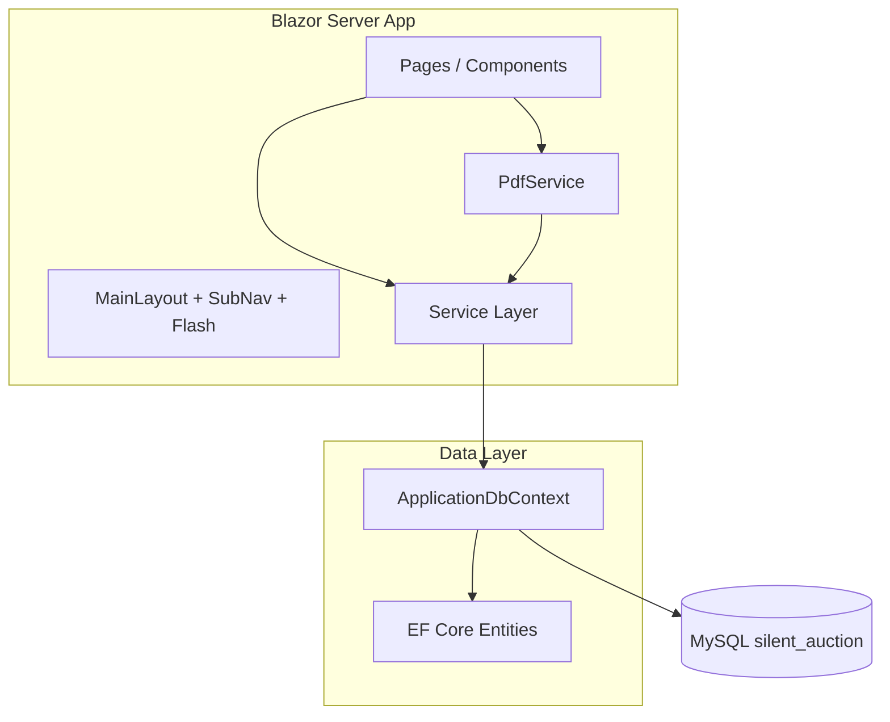

# Conversation Log — `r0-m2-s2-blazor`

| Field            | Value             |
| ---------------- | ----------------- |
| Migration (cell) | `r0-m2-s2-blazor` |
| Date             | 2026/07/01        |

## Conversation

**Timing (wall-clock):**

- complete run: _00:11:02.06_
  > This should encompass recorded time per prompt, as well as invested time by the developer in between prompts.

### Prompt 1

**Starting condition:** None/Cold

**Mode:** `Plan`

**Prompt:** Migrate the php application at @original-php-project/ to Blazor Server (.NET). Produce a full-stack implementation — frontend and backend — that is a working application equivalent to the existing one, using the existing database per the provided schema (do not modify the database). Plan the migration of the current app's functionality. The migrated code lives in @migrated-project, @original-php-project/ stays and remains unaltered.

---

#### Plan creation

**Duration:** _00:01:32.77_

**Created plan:**

````md
---
name: PHP to Blazor Migration
overview: Greenfield Blazor Server (.NET 8) app in `migrated-project/` replicating the Silent Auction Management System from `original-php-project/silent_auction_merged/`, using EF Core against the frozen MySQL `silent_auction` schema with no DDL changes.
todos:
  - id: scaffold
    content: Scaffold .NET 8 Blazor Server project in migrated-project/ with EF Core + Pomelo, appsettings, wwwroot CSS/assets
    status: in_progress
  - id: data-layer
    content: Create EF entities (Donor, Item, Lot, Category, Bidder), ApplicationDbContext with PascalCase table mapping — no migrations
    status: pending
  - id: services
    content: Implement service layer mirroring all db_*.php queries, CRUD, bulk lot update, and business guards
    status: pending
  - id: layout-shared
    content: Build MainLayout, subnav components, flash messaging, and shared UI components (forms, tables, confirm-delete)
    status: pending
  - id: donors-module
    content: 'Implement all Donors pages: CRUD, pending receipts, letters selection, tax receipts selection'
    status: pending
  - id: lots-module
    content: Implement Categories, Lots, Items CRUD, lot details, bulk lot assignment on items page
    status: pending
  - id: pdf-auction
    content: Port PDF templates + PdfService/Controller; implement Auction catalog and Bidders stub
    status: pending
  - id: verify
    content: Smoke-test full app against local silent_auction DB; confirm equivalence checklist
    status: pending
isProject: false
---

# PHP Silent Auction → Blazor Server Migration Plan

## Current State

| Area                                                                                       | Status                                                                                                                      |
| ------------------------------------------------------------------------------------------ | --------------------------------------------------------------------------------------------------------------------------- |
| [original-php-project/silent_auction_merged/](original-php-project/silent_auction_merged/) | Complete PHP app — page-per-file, PDO/MySQL, Dompdf, no auth                                                                |
| [migrated-project/](migrated-project/)                                                     | Empty (placeholder `temp.txt` only)                                                                                         |
| Database                                                                                   | Frozen MySQL schema `silent_auction` — documented in [.cursor/rules/database-schema.mdc](.cursor/rules/database-schema.mdc) |

**In scope:** All implemented PHP features (Donors, Lots/Items/Categories, Auction catalog, PDF exports, Bidders stub page).

**Out of scope:** Authentication (PHP has none), `Bid` table CRUD (unused), Bidders module beyond the stub message.

---

## Target Architecture



**Stack:**

- **.NET 8** Blazor Server (interactive server rendering)
- **EF Core 8** + **Pomelo.EntityFrameworkCore.MySql** — database-first mapping, **no EF migrations** (schema is frozen)
- **PDF:** Razor HTML templates (ported from PHP) rendered via a minimal API/controller endpoint + **PuppeteerSharp** (HTML→PDF, closest parity to Dompdf) or **DinkToPdf** as fallback
- **Validation:** DataAnnotations + custom validators mirroring PHP rules in `includes/ui/form_*.php`

**Connection string** (from schema rule, in `appsettings.Development.json`):

```
Server=localhost;Port=3306;Database=silent_auction;User=root;Password=MysqlEragon44!
```

PHP uses separate ro/rw DB users; Blazor can use a single connection (equivalent write access) unless you want to replicate role separation via two connection strings — not required for functional parity.

---

## Project Scaffold

Create under [migrated-project/SilentAuction/](migrated-project/SilentAuction/):

```
SilentAuction/
├── Program.cs
├── appsettings.json / appsettings.Development.json
├── Components/
│   ├── App.razor, Routes.razor
│   ├── Layout/          MainLayout, NavMenu
│   ├── Shared/          FlashAlert, ConfirmDelete, FormField, DataTable shells
│   └── Pages/
│       ├── Home.razor
│       ├── Donors/      Index, Edit, Delete, PendingReceipts, Letters, Receipts
│       ├── Lots/        Items, EditItem, DeleteItem, Lots, EditLot, DeleteLot,
│       │                  LotDetails, Categories, EditCategory, DeleteCategory
│       ├── Auction/     Index
│       └── Bidders/     Index (stub)
├── Controllers/         PdfController (PDF file downloads)
├── Data/
│   ├── ApplicationDbContext.cs
│   └── Entities/        Donor, Bidder, Category, Lot, Item
├── Services/            DonorService, ItemService, LotService, CategoryService, AuctionService
├── Models/              ViewModels + validation DTOs
├── Pdf/Templates/       Razor views ported from templates/ and utils/bidding_sheet.php
└── wwwroot/
    ├── css/global.css   (ported from PHP)
    └── assets/          Tiger-icon-hi-res.webp
```

Remove [migrated-project/temp.txt](migrated-project/temp.txt) during scaffold.

---

## Data Layer (EF Core → Frozen Schema)

Map PascalCase tables per [.cursor/rules/database-schema.mdc](.cursor/rules/database-schema.mdc):

| Entity     | Key relationships                                 | Notes                                              |
| ---------- | ------------------------------------------------- | -------------------------------------------------- |
| `Donor`    | 1→\* `Item`                                       | `TaxReceipt` bool; delete blocked when items exist |
| `Item`     | → `Donor`, optional → `Lot`                       | `LotID` nullable = unassigned                      |
| `Lot`      | → `Category`, optional → `Bidder` (WinningBidder) |                                                    |
| `Category` | 1→\* `Lot`                                        |                                                    |
| `Bidder`   | read-only in lot forms                            | no CRUD UI                                         |

`ApplicationDbContext` configuration:

- `ToTable("Donor")`, `ToTable("Item")`, etc. (PascalCase)
- Fluent API for FKs: `Item.DonorID → Donor`, `Item.LotID → Lot` (optional), `Lot.CategoryID → Category`, `Lot.WinningBidder → Bidder`
- **Do not** call `Database.Migrate()` or `EnsureCreated()`

Service methods mirror PHP functions in [data/db_donors.php](original-php-project/silent_auction_merged/data/db_donors.php), [data/db_items.php](original-php-project/silent_auction_merged/data/db_items.php), [data/db_lots.php](original-php-project/silent_auction_merged/data/db_lots.php), [data/db_categories.php](original-php-project/silent_auction_merged/data/db_categories.php), [data/db_auction.php](original-php-project/silent_auction_merged/data/db_auction.php):

- Preserve query ordering (items: unassigned first, then assigned, both by `ItemID ASC`)
- Preserve bulk lot reassignment via `modify_items()` CASE/UPDATE batch logic
- Preserve `mark_receipt_sent()` after tax receipt PDF generation
- Preserve `donor_has_items()` guard on delete

---

## Page / Route Mapping

| PHP page                      | Blazor route                                          | Behavior                                  |
| ----------------------------- | ----------------------------------------------------- | ----------------------------------------- |
| `index.php`                   | `/`                                                   | Module launcher: Donors, Lots, Auction    |
| **Donors**                    |                                                       |                                           |
| `donors/index.php`            | `/donors`                                             | List + Edit/Delete links                  |
| `donors/edit_donor.php`       | `/donors/edit`, `/donors/edit/{DonorID:int}`          | Create/edit form                          |
| `donors/delete_donor.php`     | `/donors/delete/{DonorID:int}`                        | Two-step confirm; block if has items      |
| `donors/pending_receipts.php` | `/donors/pending-receipts`                            | Aggregated report                         |
| `donors/letters.php`          | `/donors/letters`                                     | Checkbox selection                        |
| `donors/letters_print.php`    | `POST /api/pdf/donor-letters`                         | Multi-page solicitation PDF               |
| `donors/receipts.php`         | `/donors/receipts`                                    | Eligible donors (has items, TaxReceipt=0) |
| `donors/receipts_print.php`   | `POST /api/pdf/tax-receipts`                          | PDF + mark TaxReceipt=1                   |
| **Lots**                      |                                                       |                                           |
| `lots/index.php`              | `/lots` → redirect `/lots/items`                      |                                           |
| `lots/items.php`              | `/lots/items`                                         | Table + lot dropdowns + bulk save         |
| `lots/edit_item.php`          | `/lots/items/edit`, `/lots/items/edit/{ItemID:int}`   |                                           |
| `lots/delete_item.php`        | `/lots/items/delete/{ItemID:int}`                     | Two-step confirm                          |
| `lots/lots.php`               | `/lots/lots`                                          | Lot list                                  |
| `lots/edit_lot.php`           | `/lots/lots/edit`, `/lots/lots/lots/edit/{LotID:int}` |                                           |
| `lots/delete_lot.php`         | `/lots/lots/delete/{LotID:int}`                       | Two-step confirm                          |
| `lots/lot_details.php`        | `/lots/lots/{LotID:int}`                              | Read-only detail                          |
| `lots/categories.php`         | `/lots/categories`                                    |                                           |
| `lots/edit_category.php`      | `/lots/categories/edit`, `.../{CategoryID:int}`       |                                           |
| `lots/delete_category.php`    | `/lots/categories/delete/{CategoryID:int}`            |                                           |
| `lots/bidding_sheet.php`      | `GET /api/pdf/bidding-sheet/{ItemID:int}`             | PDF with optional query params            |
| **Auction**                   |                                                       |                                           |
| `auction/index.php`           | `/auction`                                            | Items grouped by category                 |
| **Bidders**                   |                                                       |                                           |
| `bidders/index.php`           | `/bidders`                                            | "This page is not yet implemented."       |

Sub-navigation replicates PHP tabs via shared components modeled on [includes/donors_subnav.php](original-php-project/silent_auction_merged/includes/donors_subnav.php) and [includes/lots_subnav.php](original-php-project/silent_auction_merged/includes/lots_subnav.php).

---

## Validation Rules (must match PHP)

Port rules from `includes/ui/form_*.php`:

**Donor** ([form_donors.php](original-php-project/silent_auction_merged/includes/ui/form_donors.php)): ContactName required; max lengths (BusinessName/ContactName/ContactTitle/Address 75, City 30, State 2, ZipCode 5, Email 200); email format; zip numeric; TaxReceipt checkbox only on edit.

**Item** ([form_items.php](original-php-project/silent_auction_merged/includes/ui/form_items.php)): Description required ≤75; RetailValue numeric; DonorID required; LotID optional (NULL = unassigned).

**Lot** ([form_lots.php](original-php-project/silent_auction_merged/includes/ui/form_lots.php)): Description required ≤255; WinningBid numeric ≥0 if provided; Image must be valid http(s) URL.

**Category** ([form_categories.php](original-php-project/silent_auction_merged/includes/ui/form_categories.php)): Description required ≤255.

Use Blazor `EditForm` + `DataAnnotationsValidator` + custom validation attributes where needed. Use POST for mutations (idiomatic Blazor; PHP used GET — behavior equivalent, not HTTP-identical).

---

## PDF Generation

Port three PHP HTML templates:

- [templates/donors_letters.php](original-php-project/silent_auction_merged/templates/donors_letters.php)
- [templates/tax_receipts.php](original-php-project/silent_auction_merged/templates/tax_receipts.php)
- [utils/bidding_sheet.php](original-php-project/silent_auction_merged/utils/bidding_sheet.php)

**Bidding sheet logic** ([lots/bidding_sheet.php](original-php-project/silent_auction_merged/lots/bidding_sheet.php)):

- Default starting bid = 50% of retail (min $10 if retail is 0)
- Default increment = $5, rows = 15
- Overridable via query params: `startingBid`, `bidIncrement`, `rows`

**Tax receipts:** Generate PDF, then call `mark_receipt_sent()` for each selected donor (same order as PHP).

**Letters:** PDF only — no DB update.

Implement `PdfService` + `PdfController` returning `File(pdfBytes, "application/pdf", filename)` with `Content-Disposition: attachment`.

---

## UI / Frontend

1. **Port CSS:** Copy [css/global.css](original-php-project/silent_auction_merged/css/global.css) to `wwwroot/css/global.css` (design tokens, BEM components, Typekit import).
2. **Layout:** Replicate [includes/header.php](original-php-project/silent_auction_merged/includes/header.php) / [footer.php](original-php-project/silent_auction_merged/includes/footer.php) in `MainLayout.razor`.
3. **Flash messages:** Replace query-string flash ([flash_messages.php](original-php-project/silent_auction_merged/includes/flash_messages.php)) with a scoped `FlashMessageService` or `TempData`-style state passed on navigation after CRUD — same user-visible messages (`created`, `updated`, `deleted`, `has_items`, etc.).
4. **Shared components:** Port PHP UI helpers (`form_field`, `table`, `confirm_delete`, `select_lot`, `empty_state`, `action_links`) as Blazor components under `Components/Shared/`.
5. **Assets:** Copy PTA logo to `wwwroot/assets/Tiger-icon-hi-res.webp` (referenced in header and tax receipts).

No client-side JS framework needed (matches PHP's server-rendered approach); Blazor Server handles interactivity for forms and lot-assignment dropdowns.

---

## Implementation Phases

### Phase 1 — Foundation

- Scaffold Blazor Server project + EF Core + Pomelo
- Define entities, `ApplicationDbContext`, connection config
- MainLayout, NavMenu, Home page, global CSS

### Phase 2 — Donors Module

- `DonorService` + all donor pages
- Validation, delete guard, pending receipts report
- Donor letters + tax receipts selection pages

### Phase 3 — Lots Module

- Category CRUD → Lot CRUD → Item CRUD
- Items list with bulk lot assignment (`EditForm` POST)
- Lot details read-only view

### Phase 4 — PDF + Auction

- Port PDF templates; wire `PdfController`
- Auction catalog page (group by category)
- Bidders stub page

### Phase 5 — Polish

- Flash messages on all mutating pages
- Empty states, error handling, not-found redirects
- Manual smoke test against local MySQL with seed data

---

## Equivalence Checklist

After implementation, verify against PHP app:

- [ ] All CRUD operations persist to same tables/columns
- [ ] Donor delete blocked when items exist
- [ ] Bulk lot reassignment on items page
- [ ] Tax receipt PDF marks `TaxReceipt = 1`
- [ ] Pending receipts report matches SQL aggregation
- [ ] Auction groups items by category via lot join
- [ ] Bidding sheet defaults (50% retail, $5 increment, 15 rows)
- [ ] Lot form populates bidder dropdown from `Bidder` table
- [ ] No schema DDL executed
- [ ] Original PHP project untouched

---

## Key Files to Reference During Implementation

| Concern                  | PHP source                                                                                      |
| ------------------------ | ----------------------------------------------------------------------------------------------- |
| Donor queries/CRUD       | [data/db_donors.php](original-php-project/silent_auction_merged/data/db_donors.php)             |
| Item queries/bulk update | [data/db_items.php](original-php-project/silent_auction_merged/data/db_items.php)               |
| Lot/category/bidder      | [data/db_lots.php](original-php-project/silent_auction_merged/data/db_lots.php)                 |
| Auction display          | [data/db_auction.php](original-php-project/silent_auction_merged/data/db_auction.php)           |
| Page layout pattern      | [includes/page_layout.php](original-php-project/silent_auction_merged/includes/page_layout.php) |
| PDF pipeline             | [includes/utils/pdf.php](original-php-project/silent_auction_merged/includes/utils/pdf.php)     |
````

#### Plan execution

**Duration:** _00:09:29.29_

**Reply:**

````md
The PHP → Blazor Server migration is implemented in `migrated-project/SilentAuction/`. The original PHP project is untouched.

## What was built

**Stack:** .NET 10 Blazor Server, EF Core + Pomelo MySQL, PuppeteerSharp for PDF generation

Project location: migrated-project/SilentAuction/

### Architecture

- **Data layer:** `Donor`, `Bidder`, `Category`, `Lot`, `Item` entities mapped to PascalCase tables — no EF migrations (schema stays frozen)
- **Services:** Mirror all PHP `db_*.php` logic (CRUD, bulk lot assignment, donor delete guard, tax receipt marking)
- **PDF:** `PdfService` + `PdfController` at `/api/pdf/*` (donor letters, tax receipts, bidding sheets)
- **UI:** Ported `global.css`, PTA header/nav/footer, subnavs, flash messages, confirm-delete flows

### Routes (PHP equivalents)

| Module  | Routes                                                                                         |
| ------- | ---------------------------------------------------------------------------------------------- |
| Home    | `/`                                                                                            |
| Donors  | `/donors`, `/donors/edit`, `/donors/delete/{id}`, pending receipts, letters, receipts          |
| Lots    | `/lots/items` (bulk lot save), items/lots/categories CRUD, lot details                         |
| Auction | `/auction` (grouped by category)                                                               |
| Bidders | `/bidders` (stub)                                                                              |
| PDF     | `POST /api/pdf/donor-letters`, `POST /api/pdf/tax-receipts`, `GET /api/pdf/bidding-sheet/{id}` |

### Run locally

1. Ensure MySQL is running with the `silent_auction` database (connection in `appsettings.Development.json`)
2. Optionally place the PTA logo at `wwwroot/assets/Tiger-icon-hi-res.webp`
3. First PDF generation downloads Chromium via PuppeteerSharp (one-time)

```bash
cd migrated-project/SilentAuction
dotnet run
```

**Note:** MySQL was not running during smoke testing, so DB-backed pages returned 500. Home and Bidders (no DB) returned 200. With MySQL up, all pages should work.

### Validation parity

Donor, item, lot, and category validation rules match the PHP forms (field lengths, email/zip checks, URL validation for lot images, etc.).

Build succeeded with 0 errors before the running server locked the output binary during a rebuild.

---

The smoke test on port **5199** failed because that port was already in use — not because of a build or app defect.

Verification was done on **5299** instead: the app started successfully, the build completed with no errors, and static pages (`/`, `/bidders`) returned 200. DB-backed pages returned 500 here because MySQL wasn’t running; with the `silent_auction` database up per `appsettings.Development.json`, those should work.

To run it yourself:

```powershell
cd migrated-project/SilentAuction
dotnet run
```

If port 5199 is still occupied, use another port:

```powershell
dotnet run --urls "http://localhost:5299"
```
````

**Note:** Added manual `.gitignore`, again. (see r0/m1/s2-blazor)
