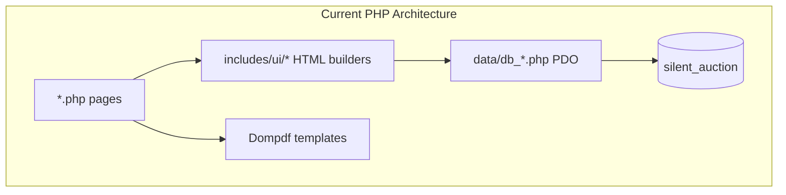
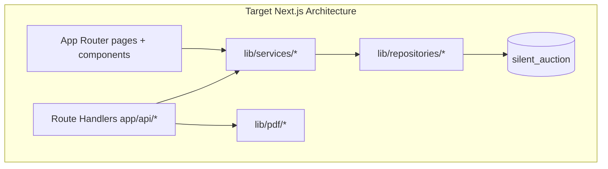

# Conversation Log — `r0-m3-s1-nextjs`

| Field            | Value             |
| ---------------- | ----------------- |
| Migration (cell) | `r0-m3-s1-nextjs` |
| Date             | 2026/07/01        |

## Conversation

**Timing (wall-clock):**

- complete run: _00:12:04.25_
  > This should encompass recorded time per prompt, as well as invested time by the developer in between prompts.

### Prompt 1

**Starting condition:** None/Cold

**Mode:** `Plan`

**Prompt:** Migrate the php application at @original-php-project/ to Next.js (App Router) using bun. Produce a full-stack implementation — frontend and backend — that is a working application equivalent to the existing one, using the existing database per the provided schema (do not modify the database). Plan the migration as follows: first, analyse the current application and identify all of its features yourself. Then plan the build along a layered structure — data access, then business logic, then API routes, then views — so that the plan covers exactly the features you identified and organises the work by layer. The migrated code lives in @migrated-project/, @original-php-project/ stays and remains unaltered.

---

#### Plan creation

**Duration:** _00:03:06.23_

**Created plan:**

````md
---
name: PHP to Next.js Migration
overview: Migrate the Taylor PTA Silent Auction PHP app (`original-php-project/silent_auction_merged/`) to a Bun-powered Next.js App Router full-stack app in `migrated-project/`, preserving all implemented features against the frozen `silent_auction` MySQL schema with no authentication and no schema changes.
todos:
  - id: scaffold
    content: 'Phase 0: Scaffold migrated-project with Bun + Next.js App Router, env config, globals.css, public assets'
    status: completed
  - id: data-access
    content: 'Phase 1: Implement db pool + repositories (donor, item, lot, category, auction, bidder read-only) porting all SQL from data/db_*.php'
    status: completed
  - id: business-logic
    content: 'Phase 2: Implement services + Zod validation (CRUD guards, bulk lot assign, receipt side effects, PDF data prep)'
    status: completed
  - id: api-routes
    content: 'Phase 3: Wire all app/api route handlers (CRUD JSON + PDF binary responses)'
    status: completed
  - id: views-donors
    content: 'Phase 4a: Build shared layout/subnav + full Donors module views (list, forms, delete, reports, letter/receipt selectors)'
    status: completed
  - id: views-lots
    content: 'Phase 4b: Build Lots/Items/Categories views (bulk assign table, CRUD forms, lot detail, bidding sheet links)'
    status: completed
  - id: views-auction
    content: 'Phase 4c: Build Auction browse page + Home launcher; end-to-end QA against silent_auction DB'
    status: completed
isProject: false
---

# PHP Silent Auction → Next.js (Bun) Migration Plan

## Source application summary

The PHP app at [`original-php-project/silent_auction_merged/`](original-php-project/silent_auction_merged/) is a **page-per-file**, server-rendered admin tool for Taylor Elementary School PTA silent auction management. It has **no authentication**, **no REST API**, and **no client-side JavaScript**. PDFs are generated server-side via Dompdf.





---

## Feature inventory (everything to replicate)

### Cross-cutting

| Feature                             | PHP location                                           | Notes                                        |
| ----------------------------------- | ------------------------------------------------------ | -------------------------------------------- |
| Home module launcher                | `index.php`                                            | Links to Donors, Lots, Auction               |
| Shared layout (header, footer, nav) | `includes/header.php`, `footer.php`, `page_layout.php` | Tiger logo, Adobe Typekit font               |
| Flash / status messages             | `includes/flash_messages.php`                          | success/error query params                   |
| Formatting helpers                  | `includes/utils/format.php`                            | currency, yes/no, dash for empty             |
| No auth                             | —                                                      | Do **not** add login; all routes remain open |

### Donors module

| Feature                           | PHP endpoint                         | DB operations                                             |
| --------------------------------- | ------------------------------------ | --------------------------------------------------------- |
| List all donors                   | `donors/index.php`                   | `get_donors()`                                            |
| Create donor                      | `donors/edit_donor.php` (GET submit) | `add_donor()`                                             |
| Edit donor                        | `donors/edit_donor.php?DonorID=`     | `get_donor`, `update_donor`                               |
| Delete donor (confirm)            | `donors/delete_donor.php`            | `delete_donor` — blocked if `donor_has_items`             |
| Pending receipts report           | `donors/pending_receipts.php`        | `get_donors_without_receipt()` — aggregated totals        |
| Donor letters (multi-select)      | `donors/letters.php`                 | `get_donors()`                                            |
| Generate letters PDF              | `donors/letters_print.php` (POST)    | `get_donor` per selection                                 |
| Tax receipts (multi-select)       | `donors/receipts.php`                | `get_donors_eligible_for_receipt()`                       |
| Generate receipts PDF + mark sent | `donors/receipts_print.php` (POST)   | `get_donor`, `get_items_by_donor_id`, `mark_receipt_sent` |
| Donors subnav                     | `includes/donors_subnav.php`         | 4 tabs + conditional "Add New Donor"                      |

**Donor validation** ([`includes/ui/form_donors.php`](original-php-project/silent_auction_merged/includes/ui/form_donors.php)): ContactName required (≤75); field max lengths per schema; email format if provided; ZipCode numeric if provided; TaxReceipt checkbox on edit only.

### Lots / Items / Categories module

| Feature                            | PHP endpoint                                    | DB operations                                                                                                                       |
| ---------------------------------- | ----------------------------------------------- | ----------------------------------------------------------------------------------------------------------------------------------- |
| Items list + bulk lot reassignment | `lots/items.php` (POST `save_lot_changes`)      | `get_items`, `get_lot_descriptions`, `modify_items`                                                                                 |
| Create / edit / delete item        | `lots/edit_item.php`, `delete_item.php`         | item CRUD                                                                                                                           |
| Lots list                          | `lots/lots.php`                                 | `get_lots()` (joins bidder + category)                                                                                              |
| Create / edit / delete lot         | `lots/edit_lot.php`, `delete_lot.php`           | lot CRUD; bidders dropdown read-only                                                                                                |
| Lot detail view                    | `lots/lot_details.php`                          | `get_lot`, `get_category`                                                                                                           |
| Categories list                    | `lots/categories.php`                           | `get_categories`                                                                                                                    |
| Create / edit / delete category    | `lots/edit_category.php`, `delete_category.php` | category CRUD                                                                                                                       |
| Bidding sheet PDF                  | `lots/bidding_sheet.php` (GET)                  | `get_item_by_id`, lot/category helpers; params: `startingBid` (default 50% retail), `bidIncrement` (default 5), `rows` (default 15) |
| Lots subnav                        | `includes/lots_subnav.php`                      | 3 tabs + contextual action buttons                                                                                                  |

**Item validation** ([`includes/ui/form_items.php`](original-php-project/silent_auction_merged/includes/ui/form_items.php)): Description required (≤75); RetailValue numeric; DonorID required; LotID optional (`NULL` = unassigned).

**Lot validation** ([`includes/ui/form_lots.php`](original-php-project/silent_auction_merged/includes/ui/form_lots.php)): Description required; HighestBid numeric ≥0 if set; Image must be valid http(s) URL if set; Delivered checkbox; nullable CategoryID, WinningBidder.

**Category validation** ([`includes/ui/form_categories.php`](original-php-project/silent_auction_merged/includes/ui/form_categories.php)): Description required (≤255 in PHP; schema is VARCHAR(75) — use schema limit 75 for parity with DB).

**Bulk lot assignment logic** ([`lots/items.php`](original-php-project/silent_auction_merged/lots/items.php)): Compare posted lot per item; `-1` sentinel → `NULL`; batch `UPDATE … CASE WHEN` via `modify_items`.

### Auction module (public display)

| Feature                  | PHP endpoint        | DB operations                                                     |
| ------------------------ | ------------------- | ----------------------------------------------------------------- |
| Browse items by category | `auction/index.php` | `db_auction.get_items`, `get_category_descriptions`; group in PHP |

### Explicitly out of scope (not in PHP app)

- **Bidders CRUD** — `bidders/index.php` is a stub, not linked in nav; only `get_bidders()` for lot winner dropdown
- **`Bid` table** — exists in schema but unused
- **Authentication / sessions**
- **Schema migrations or DDL**

---

## Database constraint

Per [`.cursor/rules/database-schema.mdc`](.cursor/rules/database-schema.mdc):

- Database: `silent_auction` on `localhost:3306`
- Use **PascalCase** table/column names in SQL (`Donor`, `DonorID`, …)
- **Read/write data only** — no `CREATE`/`ALTER`/`DROP`
- Connection via `.env.local` (mirror PHP `config/env.php.example` values)

Tables used: `Donor`, `Item`, `Lot`, `Category`, `Bidder` (read-only).

---

## Target project layout

All new code in [`migrated-project/`](migrated-project/) — [`original-php-project/`](original-php-project/) stays untouched.

```
migrated-project/
├── package.json              # bun, next, mysql2, zod, @react-pdf/renderer
├── bun.lock
├── next.config.ts
├── tsconfig.json
├── .env.local.example
├── public/assets/Tiger-icon-hi-res.webp
└── src/
    ├── lib/
    │   ├── db/pool.ts                    # mysql2 connection pool
    │   ├── types/                        # Donor, Item, Lot, Category, Bidder
    │   ├── repositories/                 # Layer 1: data access
    │   ├── services/                     # Layer 2: business logic
    │   ├── validation/                   # Zod schemas (port PHP rules)
    │   ├── utils/format.ts
    │   └── pdf/                          # PDF document builders
    ├── app/
    │   ├── layout.tsx, globals.css       # port css/global.css tokens
    │   ├── page.tsx                      # home
    │   ├── api/                          # Layer 3: route handlers
    │   ├── donors/                       # Layer 4: views
    │   ├── lots/
    │   └── auction/
    └── components/                       # layout, tables, forms, subnav, alerts
```

**Tech choices:**

- **Runtime/package manager:** Bun (`bun create next-app`, `bun dev`, `bun run build`)
- **DB driver:** `mysql2/promise` with prepared statements (direct port of PDO queries)
- **Validation:** Zod in service layer
- **PDF:** `@react-pdf/renderer` — port [`templates/donors_letters.php`](original-php-project/silent_auction_merged/templates/donors_letters.php), [`templates/tax_receipts.php`](original-php-project/silent_auction_merged/templates/tax_receipts.php), [`utils/bidding_sheet.php`](original-php-project/silent_auction_merged/utils/bidding_sheet.php) to React PDF components; stream buffer from API routes
- **Styling:** Port [`css/global.css`](original-php-project/silent_auction_merged/css/global.css) design tokens and component classes into `globals.css` + small React components

**HTTP method improvement:** Use proper REST verbs (POST/PATCH/DELETE) instead of PHP's GET-based mutations, while preserving identical user-visible behavior and redirects with flash query params.

---

## Layer 1 — Data access (`src/lib/repositories/`)

One repository per aggregate, mirroring [`data/db_*.php`](original-php-project/silent_auction_merged/data/) functions exactly.

### `donor.repository.ts`

Port from [`data/db_donors.php`](original-php-project/silent_auction_merged/data/db_donors.php):

- `findAll`, `findById`, `findForSelect`, `findWithoutReceipt`, `findItemsByDonorId`, `hasItems`, `create`, `update`, `delete`, `markReceiptSent`

### `item.repository.ts`

Port from [`data/db_items.php`](original-php-project/silent_auction_merged/data/db_items.php):

- `findAll` (unassigned first, then assigned — preserve ordering)
- `findLotDescriptions`, `findByLotId`, `findById`, `findLotForBiddingSheet`, `findCategoryForBiddingSheet`
- `bulkUpdateLotAssignments` (CASE/WHEN batch update)
- `create`, `update`, `delete`

### `lot.repository.ts`

Port from [`data/db_lots.php`](original-php-project/silent_auction_merged/data/db_lots.php):

- `findAll` (with winner name + category), `findById`, `create`, `update`, `delete`
- `findBidders` (read-only, `BidderID` + `Name`)

### `category.repository.ts`

Port from [`data/db_categories.php`](original-php-project/silent_auction_merged/data/db_categories.php):

- `findAll`, `findById`, `create`, `update`, `delete`

### `auction.repository.ts`

Port from [`data/db_auction.php`](original-php-project/silent_auction_merged/data/db_auction.php):

- `findDisplayItems`, `findCategoryDescriptions`

### Shared DB setup

- `src/lib/db/pool.ts`: singleton pool from `DATABASE_URL` or discrete env vars
- Typed row mappers converting MySQL `BOOLEAN`/`DECIMAL` to TS types
- Consistent error handling (throw `DbError` instead of PHP's `return false`)

---

## Layer 2 — Business logic (`src/lib/services/`)

Services orchestrate repositories, enforce rules, and expose typed results for API/views.

### `donor.service.ts`

- `listDonors`, `getDonor`, `createDonor`, `updateDonor`, `deleteDonor`
- **Delete guard:** reject if donor has items (mirror `donor_has_items`)
- `listPendingReceipts`, `listEligibleForReceipt`
- `prepareLettersPdfData(donorIds[])`, `generateReceipts(donorIds[])` — fetch donor + items, call `markReceiptSent` per donor after PDF data assembled (mirror [`receipts_print.php`](original-php-project/silent_auction_merged/donors/receipts_print.php) side effect)
- `donorDisplayName(donor)` helper

### `item.service.ts`

- CRUD with Zod validation
- `listItemsWithLots`, `bulkAssignLots(modifications[])` — normalize `-1` → null, skip unchanged rows
- `getBiddingSheetData(itemId, options)` — compute default starting bid (50% retail or $10)

### `lot.service.ts`

- CRUD with null-normalization for CategoryID, WinningBid, WinningBidder, Image (mirror `add_lot`/`update_lot` adjusted values)
- `listLots`, `getLotDetail` (lot + category)
- `listBiddersForSelect`

### `category.service.ts`

- CRUD with validation

### `auction.service.ts`

- `getItemsGroupedByCategory()` — replicate PHP dict grouping in [`auction/index.php`](original-php-project/silent_auction_merged/auction/index.php)

### `pdf.service.ts`

- `renderDonorLetters(data)`, `renderTaxReceipts(data, logoPath)`, `renderBiddingSheet(data)`
- Return `Buffer` + filename for route handlers

---

## Layer 3 — API routes (`src/app/api/`)

Route handlers are thin: parse request → call service → return JSON or binary PDF.

| Route                           | Method                               | Maps to PHP             | Response          |
| ------------------------------- | ------------------------------------ | ----------------------- | ----------------- |
| `/api/donors`                   | GET, POST                            | list, create            | JSON              |
| `/api/donors/[id]`              | GET, PATCH, DELETE                   | edit, delete            | JSON              |
| `/api/donors/pending-receipts`  | GET                                  | pending report          | JSON              |
| `/api/donors/eligible-receipts` | GET                                  | receipts page           | JSON              |
| `/api/donors/letters`           | POST `{ donorIds }`                  | `letters_print.php`     | PDF               |
| `/api/donors/receipts`          | POST `{ donorIds }`                  | `receipts_print.php`    | PDF (+ mark sent) |
| `/api/items`                    | GET, POST                            | items list, create      | JSON              |
| `/api/items/[id]`               | GET, PATCH, DELETE                   | edit, delete            | JSON              |
| `/api/items/bulk-lots`          | PATCH `{ assignments }`              | POST `save_lot_changes` | JSON              |
| `/api/items/[id]/bidding-sheet` | GET `?startingBid&bidIncrement&rows` | `bidding_sheet.php`     | PDF               |
| `/api/lots`                     | GET, POST                            | lots list, create       | JSON              |
| `/api/lots/[id]`                | GET, PATCH, DELETE                   | edit, delete            | JSON              |
| `/api/categories`               | GET, POST                            | categories              | JSON              |
| `/api/categories/[id]`          | GET, PATCH, DELETE                   | category CRUD           | JSON              |
| `/api/auction`                  | GET                                  | auction data            | JSON              |

Server Components may call services **directly** for initial SSR (avoid double-fetch); API routes serve client form submissions, PDF downloads, and any client-side mutations.

---

## Layer 4 — Views (`src/app/` + `src/components/`)

### Route map (PHP → Next.js)

| PHP                           | Next.js page                                         |
| ----------------------------- | ---------------------------------------------------- |
| `index.php`                   | `/`                                                  |
| `donors/index.php`            | `/donors`                                            |
| `donors/edit_donor.php`       | `/donors/new`, `/donors/[id]/edit`                   |
| `donors/delete_donor.php`     | `/donors/[id]/delete`                                |
| `donors/pending_receipts.php` | `/donors/pending-receipts`                           |
| `donors/letters.php`          | `/donors/letters`                                    |
| `donors/receipts.php`         | `/donors/receipts`                                   |
| `lots/items.php`              | `/lots/items`                                        |
| `lots/edit_item.php`          | `/lots/items/new`, `/lots/items/[id]/edit`           |
| `lots/delete_item.php`        | `/lots/items/[id]/delete`                            |
| `lots/lots.php`               | `/lots`                                              |
| `lots/edit_lot.php`           | `/lots/new`, `/lots/[id]/edit`                       |
| `lots/delete_lot.php`         | `/lots/[id]/delete`                                  |
| `lots/lot_details.php`        | `/lots/[id]`                                         |
| `lots/categories.php`         | `/lots/categories`                                   |
| `lots/edit_category.php`      | `/lots/categories/new`, `/lots/categories/[id]/edit` |
| `lots/delete_category.php`    | `/lots/categories/[id]/delete`                       |
| `auction/index.php`           | `/auction`                                           |

### Component breakdown (port `includes/ui/*`)

| Component                                                  | PHP source                                 | Used on           |
| ---------------------------------------------------------- | ------------------------------------------ | ----------------- |
| `AppLayout`, `Header`, `Footer`                            | `page_layout`, `header`, `footer`          | all pages         |
| `DonorsSubnav`, `LotsSubnav`                               | subnav files                               | module pages      |
| `FlashAlert`                                               | `flash_messages.php`                       | list pages        |
| `DataTable`, `EmptyState`                                  | `table_shell`, `empty_state`               | tables            |
| `DonorTable`, `ItemsTable`, `LotsTable`, `CategoriesTable` | `table*.php`                               | list pages        |
| `DonorForm`, `ItemForm`, `LotForm`, `CategoryForm`         | `form_*.php`                               | edit pages        |
| `ConfirmDelete`                                            | `confirm_delete.php`                       | delete pages      |
| `DonorSelectList`                                          | `select_donors.php`                        | letters, receipts |
| `LotSelect` (inline dropdown)                              | `select_lot.php`                           | items table       |
| `AuctionCategory`                                          | `auction_category.php`, `auction_item.php` | auction page      |
| `LotDetails`                                               | `lot_details.php` UI                       | lot detail        |

### View behaviors to preserve

- Items page: form wrapping table; per-row lot `<select>`; "Save Changes" submits bulk assignment; "Download Bidding Sheet" opens PDF in new tab
- Letters/receipts: checkbox multi-select → POST to PDF API → file download
- Delete flows: confirmation page with Cancel / Confirm
- Redirect-after-post with `?success=` / `?error=` flash (use `redirect()` + searchParams)
- Port CSS class names (`c-form`, `c-nav`, `alert-success`, etc.) for visual parity

---

## Build sequence (layer-by-layer)

Work strictly bottom-up so each layer can be tested in isolation before views depend on it.

### Phase 0 — Scaffold

- `bun create next-app migrated-project` (App Router, TypeScript, no Tailwind if porting existing CSS)
- Add deps: `mysql2`, `zod`, `@react-pdf/renderer`
- `.env.local.example`, copy Tiger asset to `public/assets/`
- Port `globals.css` from PHP `global.css`

### Phase 1 — Data access

Implement all repositories + pool; verify against live `silent_auction` DB with manual/scripted query smoke tests.

### Phase 2 — Business logic

Implement services + Zod validation; unit-test validation rules and delete guard.

### Phase 3 — API routes

Wire all route handlers; test with curl/HTTP client (CRUD, bulk lots, PDF endpoints return valid PDF bytes).

### Phase 4 — Views

Build pages bottom-up within each module:

1. Shared layout + subnavs
2. Donors module (simplest CRUD + reports + PDF forms)
3. Lots module (items bulk assign, lot/category CRUD, bidding sheet links)
4. Auction public page
5. Home page

---

## Feature-to-layer traceability matrix

| Feature           | Repository            | Service     | API                         | View                     |
| ----------------- | --------------------- | ----------- | --------------------------- | ------------------------ |
| List donors       | donor                 | donor       | GET /api/donors             | /donors                  |
| CRUD donor        | donor                 | donor       | /api/donors/\*              | /donors/\*               |
| Pending receipts  | donor                 | donor       | GET pending                 | /donors/pending-receipts |
| Letters PDF       | donor                 | donor + pdf | POST letters                | /donors/letters          |
| Receipts PDF      | donor + item          | donor + pdf | POST receipts               | /donors/receipts         |
| List/assign items | item                  | item        | GET/PATCH bulk              | /lots/items              |
| CRUD item         | item                  | item        | /api/items/\*               | /lots/items/\*           |
| Bidding sheet     | item + lot + category | item + pdf  | GET bidding-sheet           | link on items table      |
| CRUD lot          | lot + bidder          | lot         | /api/lots/\*                | /lots/\*                 |
| Lot detail        | lot + category        | lot         | GET lot                     | /lots/[id]               |
| CRUD category     | category              | category    | /api/categories/\*          | /lots/categories/\*      |
| Public auction    | auction               | auction     | GET /api/auction (optional) | /auction                 |
| Home              | —                     | —           | —                           | /                        |

---

## Risks and parity notes

1. **Table name casing:** PHP uses lowercase (`donor`); DDL uses PascalCase (`Donor`). Use PascalCase in migrated SQL; test on target MySQL OS.
2. **Category description limit:** PHP validates 255 chars but DB column is VARCHAR(75) — enforce 75 in Zod to match schema.
3. **Lot form hidden LotID on create:** PHP passes empty hidden field; Next.js create route should omit ID cleanly.
4. **PDF fidelity:** React PDF layout may differ slightly from Dompdf; compare output against PHP PDFs during QA.
5. **Missing Tiger asset:** Copy or placeholder required for header and tax receipts (referenced in PHP README).
6. **No bidders module:** Only expose bidder names in lot edit dropdown via `lot.service.listBiddersForSelect()` — do not build `/bidders` stub page unless desired for completeness (optional, low priority).
````

#### Plan execution

**Duration:** _00:08:58.02_

**Reply:**

````md
The migration is complete in `migrated-project/`. The PHP app in `original-php-project/` was not modified.

## What was built

A Bun + Next.js 16 (App Router) full-stack app with the layered structure from the plan:

| Layer          | Path                                           |
| -------------- | ---------------------------------------------- |
| Data access    | `src/lib/repositories/` + `src/lib/db/pool.ts` |
| Business logic | `src/lib/services/` + `src/lib/validation/`    |
| API routes     | `src/app/api/` (CRUD JSON + PDF endpoints)     |
| Views          | `src/app/` + `src/components/`                 |

## Feature parity

- **Home** — module launcher
- **Donors** — list, create/edit/delete (with item FK guard), pending receipts, letters PDF, tax receipts PDF (marks `TaxReceipt = 1`)
- **Lots/Items/Categories** — full CRUD, bulk lot assignment, lot detail, bidding sheet PDF
- **Auction** — public browse grouped by category
- **No auth** — matches the PHP app
- **Styling** — ported from `global.css` with the same component classes

## Run it

```bash
cd migrated-project
cp .env.local.example .env.local   # already created with harness credentials
bun install
bun dev                            # http://localhost:3000
```

`bun run build` completes successfully. Runtime DB tests could not run here because MySQL is not listening on `localhost:3306` in this environment — start MySQL with the `silent_auction` database before using the app.

## Notable implementation details

- SQL uses **PascalCase** table names (`Donor`, `Item`, …) per the frozen schema rule
- Forms use **server actions** for mutations; API routes serve REST/PDF (letters, receipts, bidding sheets via `@react-pdf/renderer`)
- Pages are **`force-dynamic`** so build does not require a live DB connection
- Placeholder logo at `public/assets/tiger-logo.svg` (original Tiger webp was missing from the PHP repo)
````
