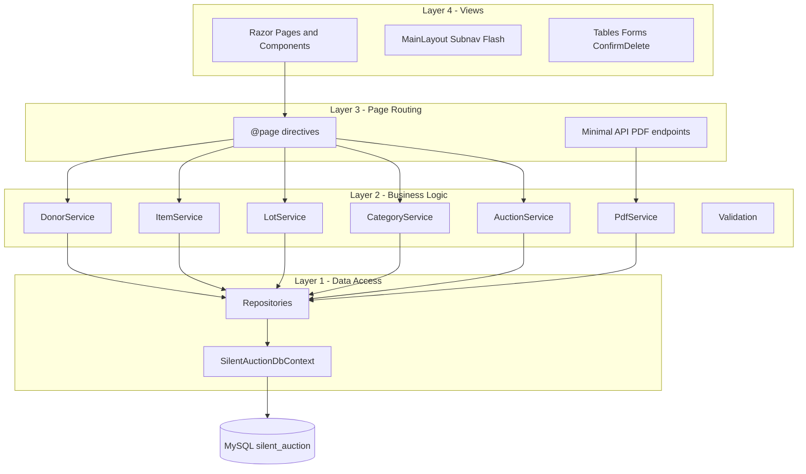

# Conversation Log — `r0-m3-s2-blazor`

| Field            | Value             |
| ---------------- | ----------------- |
| Migration (cell) | `r0-m3-s2-blazor` |
| Date             | 2026/07/01        |

## Conversation

**Timing (wall-clock):**

- complete run: _00:08:13.62_
  > This should encompass recorded time per prompt, as well as invested time by the developer in between prompts.

### Prompt 1

**Starting condition:** None/Cold

**Mode:** `Plan`

**Prompt:** Migrate the php application at @original-php-project/ to Blazor Server (.NET). Produce a full-stack implementation — frontend and backend — that is a working application equivalent to the existing one, using the existing database per the provided schema (do not modify the database). Plan the migration as follows: first, analyse the current application and identify all of its features yourself. Then plan the build along a layered structure — data access, then business logic, then page routing, then views — so that the plan covers exactly the features you identified and organises the work by layer. The migrated code lives in @migrated-project/, @original-php-project/ stays and remains unaltered.

---

#### Plan creation

**Duration:** _00:02:16.27_

**Created plan:**

````md
---
name: PHP to Blazor Migration
overview: Migrate the Taylor Elementary PTA Silent Auction PHP app to a new .NET 8 Blazor Server solution in `migrated-project/`, preserving all implemented PHP features against the frozen `silent_auction` MySQL schema, built bottom-up through data access, business logic, routing, and views.
todos:
  - id: scaffold-solution
    content: Create .NET 8 Blazor Server solution in migrated-project/ (Pomelo MySQL, QuestPDF, appsettings connection string)
    status: in_progress
  - id: layer1-data
    content: Implement DbContext, entities (Donor/Item/Lot/Category/Bidder), and repository interfaces mirroring all db_*.php functions
    status: pending
  - id: layer2-services
    content: Implement services (Donor, Item, Lot, Category, Auction, Pdf, Format) with validation and business rules
    status: pending
  - id: layer3-routing
    content: Define all @page routes, redirects, flash query params, and 3 Minimal API PDF endpoints
    status: pending
  - id: layer4-layout
    content: Build MainLayout, DonorsSubnav, LotsSubnav, FlashAlert, and shared UI components
    status: pending
  - id: layer4-donors
    content: 'Implement Donors pages: Index, Edit, Delete, PendingReceipts, Letters, Receipts'
    status: pending
  - id: layer4-lots
    content: 'Implement Lots pages: Items (bulk save), Item/Lot/Category CRUD, LotDetails'
    status: pending
  - id: layer4-auction-home
    content: Implement Home, Auction catalog, and Bidders stub page
    status: pending
  - id: pdf-documents
    content: Port donor letters, tax receipts, and bidding sheet to QuestPDF with logo asset
    status: pending
  - id: verify-parity
    content: Manual end-to-end verification against silent_auction DB for all features
    status: pending
isProject: false
---

# PHP Silent Auction → Blazor Server Migration Plan

## Current state

| Area          | Status                                                                                                                                           |
| ------------- | ------------------------------------------------------------------------------------------------------------------------------------------------ |
| Reference app | Complete at [`original-php-project/silent_auction_merged/`](original-php-project/silent_auction_merged/) — **read-only, do not modify**          |
| Target        | [`migrated-project/`](migrated-project/) — empty (only `temp.txt` placeholder)                                                                   |
| Database      | Frozen MySQL schema `silent_auction` per [`.cursor/rules/database-schema.mdc`](.cursor/rules/database-schema.mdc) — data read/write only, no DDL |
| Auth          | None in PHP — migrated app stays unauthenticated                                                                                                 |

---

## Part 1 — Feature inventory (from PHP analysis)

### Cross-cutting

- **Shared layout**: header with PTA logo, page title, module subnav (Donors / Lots), footer
- **Flash messages**: success/error via query string (`created`, `updated`, `deleted`, `has_items`, `notfound`, `no_selection`, etc.)
- **Formatting helpers**: currency (`$X.XX`), yes/no, dash for empty values, donor display name (BusinessName → ContactName fallback)
- **No authentication**, no sessions, no CSRF

### Home (`index.php`)

- Landing page with links to Donors, Lots, Auction modules

### Donors module (7 functional routes + 2 PDF endpoints)

| Feature                 | PHP route                                     | Behavior                                                                                  |
| ----------------------- | --------------------------------------------- | ----------------------------------------------------------------------------------------- |
| Donor list              | `/donors/index.php`                           | Table: ID, business, contact, email, city, state, tax-receipt flag; Edit/Delete           |
| Create/edit donor       | `/donors/edit_donor.php`                      | Form with validation; manual TaxReceipt toggle on edit                                    |
| Delete donor            | `/donors/delete_donor.php`                    | Confirm page; blocked if donor has items                                                  |
| Pending receipts report | `/donors/pending_receipts.php`                | Donors with items where `TaxReceipt = 0`; shows item count + total value                  |
| Solicitation letters    | `/donors/letters.php` + `letters_print.php`   | Checkbox selection → multi-page PDF (no DB change)                                        |
| Tax receipts            | `/donors/receipts.php` + `receipts_print.php` | Select eligible donors (has items, no receipt) → PDF; **sets `TaxReceipt = 1`** per donor |

**Donor validation rules** (from [`includes/ui/form_donors.php`](original-php-project/silent_auction_merged/includes/ui/form_donors.php)): ContactName required (≤75); optional BusinessName/Title/Address/City/State/Zip; email format if provided; ZipCode numeric if provided; field max lengths per schema.

### Lots module (11 routes + bidding sheet PDF)

| Feature           | PHP route                                                    | Behavior                                                                                                      |
| ----------------- | ------------------------------------------------------------ | ------------------------------------------------------------------------------------------------------------- |
| Items list        | `/lots/items.php`                                            | Items with donor + lot; inline lot dropdowns; bulk POST save (`modify_items` CASE/UPDATE); bidding-sheet link |
| Item CRUD         | `edit_item.php`, `delete_item.php`                           | Description, retail value, donor (required), optional lot (`-1` → `NULL`)                                     |
| Lots list         | `/lots/lots.php`                                             | Highest bid, winner name, delivered, category                                                                 |
| Lot CRUD          | `edit_lot.php`, `delete_lot.php`, `lot_details.php`          | Description, category, winning bid, winning bidder dropdown, delivered, image URL (`http`/`https`)            |
| Categories CRUD   | `categories.php`, `edit_category.php`, `delete_category.php` | Description only; no FK guards on delete                                                                      |
| Bidding sheet PDF | `/lots/bidding_sheet.php`                                    | Per item; defaults: starting bid = 50% retail (or $10), increment $5, 15 rows; overridable via query params   |

`/lots/index.php` redirects to items.

### Auction module (public browse)

| Feature             | PHP route            | Behavior                                                                                            |
| ------------------- | -------------------- | --------------------------------------------------------------------------------------------------- |
| Catalog by category | `/auction/index.php` | All categories rendered; items grouped by lot's `CategoryID`; shows description + retail value only |

Items without a lot (or lot without category) do not appear under any category section — preserve this behavior.

### Bidders module (stub only)

| Feature          | PHP route                   | Behavior                                                  |
| ---------------- | --------------------------- | --------------------------------------------------------- |
| Placeholder page | `/bidders/index.php`        | "This page is not yet implemented."                       |
| Read-only usage  | `get_bidders()` in lot form | Dropdown of `BidderID` + `Name` only — **no Bidder CRUD** |

### Explicitly out of scope (schema exists, PHP unused)

- `Bid` table and live self-service bidding
- Full Bidder management (Address, CellNumber, Email, Paid)
- Email sending, file uploads (images are URL strings)

### PDF generation (3 document types)

PHP uses Dompdf + HTML templates in [`templates/`](original-php-project/silent_auction_merged/templates/) and [`utils/bidding_sheet.php`](original-php-project/silent_auction_merged/utils/bidding_sheet.php). Logo: [`assets/Tiger-icon-hi-res.webp`](original-php-project/silent_auction_merged/assets/Tiger-icon-hi-res.webp).

---

## Part 2 — Target architecture



**Tech choices**

- .NET 8 **Blazor Server** (interactive server components)
- **EF Core** + **Pomelo.EntityFrameworkCore.MySql** — entities scaffolded/mapped to existing PascalCase tables; **no EF migrations that alter schema**
- **QuestPDF** for PDF output (replicate PHP template content/layout; avoids native wkhtmltopdf dependencies on Windows)
- Connection string in `appsettings.json` using values from [`database-schema.mdc`](.cursor/rules/database-schema.mdc)

**Proposed solution layout** (all under `migrated-project/`):

```
SilentAuction.sln
SilentAuction/
  Program.cs
  appsettings.json
  Data/
    SilentAuctionDbContext.cs
    Entities/          Donor, Item, Lot, Category, Bidder
    Repositories/      IDonorRepository, IItemRepository, ...
  Services/            DonorService, ItemService, LotService, ...
  Models/              Form models, DTOs, OperationResult
  Validation/          DonorValidator, ItemValidator, ...
  Pdf/                 DonorLetterDocument, TaxReceiptDocument, BiddingSheetDocument
  Components/
    Layout/            MainLayout, DonorsSubnav, LotsSubnav
    Shared/            DataTable, FlashAlert, ConfirmDelete, PageIntro, ...
  Pages/
    Home.razor
    Donors/            Index, Edit, Delete, PendingReceipts, Letters, Receipts
    Lots/              Items, EditItem, DeleteItem, Lots, EditLot, ...
    Auction/           Index
    Bidders/           Index (stub)
  wwwroot/
    css/global.css     Port from PHP
    assets/            Copy Tiger logo
```

---

## Part 3 — Layer 1: Data access

Map each PHP `data/db_*.php` file to a repository interface + EF Core implementation.

### DbContext and entities

| Entity     | Table      | Key relationships                            |
| ---------- | ---------- | -------------------------------------------- |
| `Donor`    | `Donor`    | 1→many `Item`                                |
| `Item`     | `Item`     | FK `DonorID`, nullable FK `LotID`            |
| `Lot`      | `Lot`      | FK `CategoryID`, nullable FK `WinningBidder` |
| `Category` | `Category` | 1→many `Lot`                                 |
| `Bidder`   | `Bidder`   | read-only for dropdowns                      |

Configure in `OnModelCreating`: table/column names match DDL; `Item.LotID` nullable; boolean columns as `bool`; decimals as `decimal(10,2)`. Do **not** map `Bid` unless needed later.

### Repository contracts (mirror PHP functions)

**`IDonorRepository`** ← [`data/db_donors.php`](original-php-project/silent_auction_merged/data/db_donors.php)

- `GetAll()`, `GetById()`, `GetForSelect()`, `GetWithoutReceipt()` (aggregated query with COUNT/SUM)
- `GetItemsByDonorId()`, `DonorHasItems()`
- `Add()`, `Update()`, `Delete()`, `MarkReceiptSent()`

**`IItemRepository`** ← [`data/db_items.php`](original-php-project/silent_auction_merged/data/db_items.php)

- `GetAllWithDonorAndLot()` (unassigned first, then assigned — preserve sort)
- `GetByIdWithDetails()`, `GetByLotId()`, `GetLotDescriptions()`
- `BulkUpdateLotAssignments()` (translate PHP `modify_items` CASE/UPDATE to EF `ExecuteUpdate` loop or raw SQL)
- `Add()`, `Update()`, `Delete()`
- `GetLotForBiddingSheet()`, `GetCategoryForBiddingSheet()`

**`ILotRepository`** ← [`data/db_lots.php`](original-php-project/silent_auction_merged/data/db_lots.php)

- `GetAllWithWinnerAndCategory()`, `GetById()`, `GetBidders()` (BidderID + Name)
- `Add()`, `Update()`, `Delete()` — handle NULL coercion for CategoryID, WinningBid, WinningBidder, Image

**`ICategoryRepository`** ← [`data/db_categories.php`](original-php-project/silent_auction_merged/data/db_categories.php)

- `GetAll()`, `GetById()`, `Add()`, `Update()`, `Delete()`

**`IAuctionRepository`** ← [`data/db_auction.php`](original-php-project/silent_auction_merged/data/db_auction.php)

- `GetItemsWithCategoryId()`, `GetCategoryDescriptions()`

### DI registration

```csharp
services.AddDbContext<SilentAuctionDbContext>(options =>
    options.UseMySql(connectionString, ServerVersion.AutoDetect(connectionString)));
services.AddScoped<IDonorRepository, DonorRepository>();
// ... other repositories
```

---

## Part 4 — Layer 2: Business logic

Services sit between pages and repositories; encapsulate rules currently split across PHP UI + data files.

### `DonorService`

- `GetDisplayName(donor)` — BusinessName fallback
- `CanDelete(donorId)` → checks `DonorHasItems`; return typed `DeleteResult` (`HasItems`, `NotFound`, `Success`)
- `GetEligibleForReceipt()` — has items + `TaxReceipt == false`
- `GenerateTaxReceipts(donorIds)` — load donor + items, call `MarkReceiptSent` per donor, return data for PDF
- `GenerateSolicitationLetters(donorIds)` — load donors, return data for PDF (no DB write)

### `ItemService`

- `SaveLotAssignments(Dictionary<int, int?>)` — map UI sentinel `-1` / empty to `NULL`
- Item form validation: Description required ≤75, RetailValue numeric, DonorID required, LotID optional

### `LotService`

- Nullable field normalization (empty strings → null) matching PHP `add_lot`/`update_lot`
- Image URL validation: must start with `http://` or `https://` when provided
- Lot list/detail DTOs include joined winner name + category description

### `CategoryService`

- Description required ≤75 (schema); straight CRUD

### `AuctionService`

- `GetCatalogByCategory()` — group items by `CategoryID`; iterate all categories (including empty)

### `PdfService`

- `GenerateDonorLettersPdf(donors)` → `byte[]`
- `GenerateTaxReceiptsPdf(donorsWithItems, logoPath)` → `byte[]`
- `GenerateBiddingSheetPdf(item, lot, category, startingBid, increment, rows)` → `byte[]`
- Bidding sheet defaults: `startingBid = retail > 0 ? retail * 0.5 : 10`, `increment = 5`, `rows = 15`

### `FormatService` (or static helpers)

Port [`includes/utils/format.php`](original-php-project/silent_auction_merged/includes/utils/format.php): `FormatCurrency`, `FormatYesNo`, `FormatOrDash`.

### Result / flash mapping

Introduce `OperationResult` with codes matching PHP flash params so views can show equivalent messages.

---

## Part 5 — Layer 3: Page routing

### Blazor page routes (interactive UI)

| Blazor route                                                      | PHP equivalent                    |
| ----------------------------------------------------------------- | --------------------------------- |
| `/`                                                               | `/index.php`                      |
| `/donors`                                                         | `/donors/index.php`               |
| `/donors/edit`                                                    | `/donors/edit_donor.php` (create) |
| `/donors/edit/{DonorId:int}`                                      | edit with ID                      |
| `/donors/delete/{DonorId:int}`                                    | `/donors/delete_donor.php`        |
| `/donors/pending-receipts`                                        | `/donors/pending_receipts.php`    |
| `/donors/letters`                                                 | `/donors/letters.php`             |
| `/donors/receipts`                                                | `/donors/receipts.php`            |
| `/lots` → redirect `/lots/items`                                  | `/lots/index.php`                 |
| `/lots/items`                                                     | `/lots/items.php`                 |
| `/lots/items/edit`, `/lots/items/edit/{ItemId:int}`               | `edit_item.php`                   |
| `/lots/items/delete/{ItemId:int}`                                 | `delete_item.php`                 |
| `/lots/lots`                                                      | `/lots/lots.php`                  |
| `/lots/lots/edit`, `/lots/lots/edit/{LotId:int}`                  | `edit_lot.php`                    |
| `/lots/lots/{LotId:int}`                                          | `lot_details.php`                 |
| `/lots/lots/delete/{LotId:int}`                                   | `delete_lot.php`                  |
| `/lots/categories`                                                | `categories.php`                  |
| `/lots/categories/edit`, `/lots/categories/edit/{CategoryId:int}` | `edit_category.php`               |
| `/lots/categories/delete/{CategoryId:int}`                        | `delete_category.php`             |
| `/auction`                                                        | `/auction/index.php`              |
| `/bidders`                                                        | `/bidders/index.php` (stub)       |

### PDF endpoints (Minimal API — file download)

Blazor components are awkward for binary PDF responses; add 3 endpoints in `Program.cs`:

| Endpoint                          | Method                                                 | PHP equivalent       |
| --------------------------------- | ------------------------------------------------------ | -------------------- |
| `/api/pdf/donor-letters`          | POST (body: donor IDs)                                 | `letters_print.php`  |
| `/api/pdf/tax-receipts`           | POST (body: donor IDs)                                 | `receipts_print.php` |
| `/api/pdf/bidding-sheet/{itemId}` | GET (+ optional `startingBid`, `bidIncrement`, `rows`) | `bidding_sheet.php`  |

Letter/receipt pages POST via `<form>` or `HttpClient` from a small JS interop helper; tax-receipt endpoint must call `MarkReceiptSent` before generating PDF (same order as PHP).

### Flash messages

After mutations, `NavigationManager.NavigateTo("/donors?success=created")` — `FlashAlert` component reads `SupplyParameterFromQuery` for `success` / `error`.

### `App.razor` / `Routes.razor`

Default Blazor Server setup with `MainLayout` wrapping all pages.

---

## Part 6 — Layer 4: Views

Build views **after** layers 1–3 are wired; each page is a thin orchestrator calling services.

### Layout and navigation

- **`MainLayout.razor`**: port [`includes/header.php`](original-php-project/silent_auction_merged/includes/header.php) + footer; global nav (Home, Donors, Lots, Auction)
- **`DonorsSubnav.razor`**: port [`includes/donors_subnav.php`](original-php-project/silent_auction_merged/includes/donors_subnav.php) — tabs + conditional "Add New Donor" button
- **`LotsSubnav.razor`**: port [`includes/lots_subnav.php`](original-php-project/silent_auction_merged/includes/lots_subnav.php) — tabs + contextual actions (Add Item, Save Changes, Add Lot, Delete Lot/Category)
- **`FlashAlert.razor`**: port [`includes/flash_messages.php`](original-php-project/silent_auction_merged/includes/flash_messages.php)

### Shared components (from `includes/ui/`)

| Component           | PHP source                           | Used on                      |
| ------------------- | ------------------------------------ | ---------------------------- |
| `DataTable`         | `table.php`, `table_shell.php`       | List pages                   |
| `ConfirmDelete`     | `confirm_delete.php`                 | Delete flows                 |
| `PageIntro`         | `page_intro.php`                     | Section headers              |
| `EmptyState`        | `empty_state.php`                    | Empty lists                  |
| `DonorSelectList`   | `select_donors.php`                  | Letters, receipts            |
| `LotSelect`         | `select_lot.php`                     | Items list inline assignment |
| Form field wrappers | `form_field.php`, `form_actions.php` | All edit forms               |

### Page-by-page view work (maps 1:1 to features)

**Donors**

1. `Donors/Index.razor` — donor table + action links
2. `Donors/Edit.razor` — `EditForm` + validation messages
3. `Donors/Delete.razor` — confirm + guard message if has items
4. `Donors/PendingReceipts.razor` — aggregated report table
5. `Donors/Letters.razor` — checkbox list + form POST to PDF API
6. `Donors/Receipts.razor` — eligible donors + form POST to PDF API

**Lots**

7. `Lots/Items.razor` — table with lot dropdowns + `EditForm` for bulk save
8. `Lots/EditItem.razor`, `DeleteItem.razor`
9. `Lots/Lots.razor` — lot list with View/Edit links
10. `Lots/EditLot.razor` — category + bidder dropdowns, delivered checkbox, image URL
11. `Lots/LotDetails.razor` — read-only detail (join winner name in service layer to fix PHP `lot_details.php` gap)
12. `Lots/Categories.razor`, `EditCategory.razor`, `DeleteCategory.razor`

**Auction + Home + Bidders**

13. `Auction/Index.razor` — category sections with item cards (`auction_category.php`, `auction_item.php`)
14. `Home.razor` — module links
15. `Bidders/Index.razor` — static stub text

### Styling

- Copy [`css/global.css`](original-php-project/silent_auction_merged/css/global.css) to `wwwroot/css/global.css` and reference from `App.razor` / `index.html`
- Copy logo to `wwwroot/assets/Tiger-icon-hi-res.webp`
- Reuse existing BEM-style class names (`c-nav__item`, `o-flex`, etc.) so markup structure matches PHP

---

## Part 7 — Bootstrap and delivery order

Execute in this sequence so each layer is testable before the next:

1. **Scaffold solution** — `dotnet new blazorserver` in `migrated-project/`; remove `temp.txt`; add Pomelo + QuestPDF packages
2. **Layer 1** — DbContext, entities, all repositories; smoke-test DB connectivity
3. **Layer 2** — services + validators; unit-test key rules (donor delete guard, receipt eligibility, bidding sheet defaults, lot NULL coercion)
4. **Layer 3** — register routes + PDF Minimal API endpoints; verify navigation skeleton loads
5. **Layer 4** — layout/subnav/shared components, then Donors pages, Lots pages, Auction, Home, Bidders stub
6. **PDF templates** — implement QuestPDF documents matching PHP template content
7. **Manual verification** — walk every route against seeded DB; compare behavior to PHP app

---

## Parity notes (intentional matches)

| Behavior                             | Decision                                                              |
| ------------------------------------ | --------------------------------------------------------------------- |
| No login                             | Do not add ASP.NET Identity                                           |
| Bidders CRUD                         | Stub page only; read bidders for lot dropdown                         |
| `Bid` table                          | Not used                                                              |
| Category/lot delete without FK guard | Match PHP (direct delete)                                             |
| Donor delete with items              | Block with `has_items` error                                          |
| Tax receipt POST                     | Mark sent **before** PDF generation                                   |
| GET-based PHP forms                  | Use idiomatic Blazor `EditForm` POST — equivalent UX, better security |
| PHP debug `echo` in `db_lots.php`    | Omit in migration                                                     |

---

## Verification checklist

- [ ] All 25 functional PHP routes have a Blazor/API equivalent
- [ ] CRUD on Donor, Item, Lot, Category works against live `silent_auction` DB
- [ ] Bulk lot assignment on items page persists correctly (`NULL` for unassigned)
- [ ] Donor delete blocked when items exist
- [ ] Tax receipt flow sets `TaxReceipt = 1` and downloads PDF
- [ ] Donor letters PDF downloads without DB changes
- [ ] Bidding sheet PDF with default and custom parameters
- [ ] Auction page groups items by category
- [ ] Bidders page shows stub message
- [ ] `original-php-project/` untouched
````

#### Plan execution

**Duration:** _00:05:57.34_

**Reply:**

````md
The PHP → Blazor Server migration is implemented in `migrated-project/`. Summary:

## Solution structure

```
migrated-project/
  SilentAuction.sln
  SilentAuction/
    Data/           — EF Core DbContext, entities, repositories
    Services/       — Donor, Item, Lot, Category, Auction, Format
    Validation/     — Form validators matching PHP rules
    Pdf/            — QuestPDF documents + PdfService
    Models/         — DTOs, form models, OperationResult
    Components/
      Layout/       — MainLayout, DonorsSubnav, LotsSubnav
      Shared/       — FlashAlert, Subnav, DataTable, ConfirmDelete
      Pages/        — All routes (Home, Donors, Lots, Auction, Bidders)
    wwwroot/css/global.css + assets/Tiger-icon-hi-res.webp
```

## Features migrated

| Module      | Routes                                                                                       |
| ----------- | -------------------------------------------------------------------------------------------- |
| **Home**    | `/`                                                                                          |
| **Donors**  | List, create/edit, delete (with item guard), pending receipts, letters PDF, tax receipts PDF |
| **Lots**    | Items (bulk lot assignment), item/lot/category CRUD, lot details, bidding sheet PDF          |
| **Auction** | Public catalog grouped by category                                                           |
| **Bidders** | Stub page (parity with PHP)                                                                  |

**PDF endpoints:** `POST /api/pdf/donor-letters`, `POST /api/pdf/tax-receipts`, `GET /api/pdf/bidding-sheet/{itemId}`

## Run locally

1. Ensure MySQL is running with the `silent_auction` database seeded.
2. Connection string is in `SilentAuction/appsettings.json` (from the schema rule).
3. From `migrated-project/SilentAuction/`:

```bash
dotnet run
```

The project builds cleanly (`dotnet build` — 0 errors). Static pages (`/`, `/bidders`) return 200; data pages need a live MySQL connection. In this environment MySQL was not reachable, so DB-backed routes returned 500 during smoke testing.

## Parity notes

- No authentication (matches PHP)
- Tax receipts mark `TaxReceipt = 1` before PDF generation
- Donor delete blocked when items exist
- Bidding sheet defaults: 50% retail starting bid (min $10), $5 increment, 15 rows
- `original-php-project/` was not modified
- Table mapping uses PascalCase per DDL (`Donor`, `Item`, etc.)

If the harness DB uses lowercase table names on Linux, update `ToTable(...)` in `SilentAuctionDbContext.cs` to match.
````
