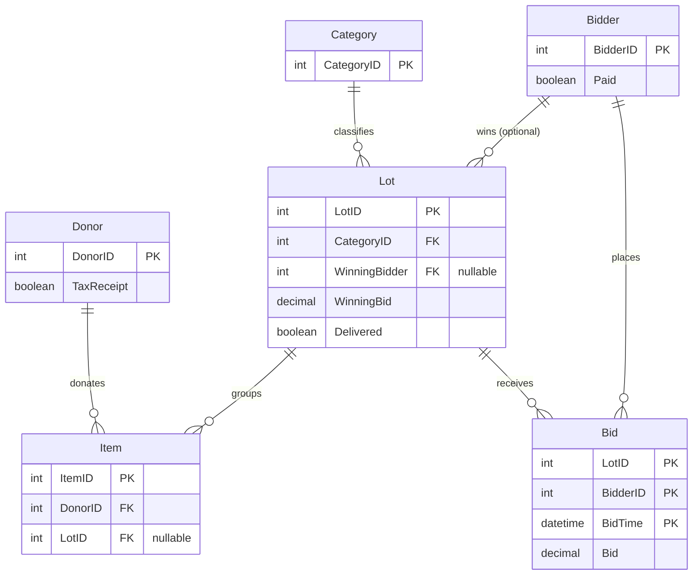

# Data model relationships — silent_auction

**Source app:** `original-immutable/silent_auction_merged/`  
**Schema:** [database.sql](./database.sql) · **Seed data:** [seed.sql](./seed.sql)

The schema defines six tables. Relationships are **logical only** — there are no `FOREIGN KEY` constraints in `database.sql`. The PHP app enforces some rules in application code (for example, blocking donor delete when items exist).

---

## Entity-relationship overview

---

## Logical relationships

| Child table | Column(s)       | Parent table          | Cardinality | Nullable         | Used by merged app                                  |
| ----------- | --------------- | --------------------- | ----------- | ---------------- | --------------------------------------------------- |
| `Item`      | `DonorID`       | `Donor.DonorID`       | N : 1       | No (in practice) | Yes — donor CRUD, tax receipts, item forms          |
| `Item`      | `LotID`         | `Lot.LotID`           | N : 1       | Yes              | Yes — lot assignment (`lots/items.php`), item lists |
| `Lot`       | `CategoryID`    | `Category.CategoryID` | N : 1       | Yes              | Yes — lot list/details, auction grouping            |
| `Lot`       | `WinningBidder` | `Bidder.BidderID`     | N : 1       | Yes              | Yes — lot list join; open lots have `NULL`          |
| `Bid`       | `LotID`         | `Lot.LotID`           | N : 1       | No               | **No** — optional; live bidding only                |
| `Bid`       | `BidderID`      | `Bidder.BidderID`     | N : 1       | No               | **No** — optional; live bidding only                |

`Bid` uses a composite primary key `(LotID, BidderID, BidTime)` so one bidder can place multiple bids on the same lot over time.

---

## How the app traverses relationships

Joins appear in `original-immutable/silent_auction_merged/data/db_*.php`:

| Query purpose                          | Tables joined                     | File             |
| -------------------------------------- | --------------------------------- | ---------------- |
| Item list with donor and lot           | `item` → `donor`, `lot`           | `db_items.php`   |
| Donors eligible for tax receipt        | `donor` INNER JOIN `item`         | `db_donors.php`  |
| Lot list with winner name and category | `lot` → `bidder`, `category`      | `db_lots.php`    |
| Auction display by category            | `item` → `lot` (for `CategoryID`) | `db_auction.php` |

`bidder` is also read directly for lot create/edit dropdowns (`get_bidders()` in `db_lots.php`). No PHP code queries the `Bid` table in the merged app.

---

## Application-level rules (not in schema)

- **Donor delete:** blocked when the donor has any `Item` rows (`db_donors.php`).
- **Tax receipt:** `Donor.TaxReceipt` flips to `1` when a receipt PDF is generated (side effect on read path).
- **Lot assignment:** bulk update via `lots/items.php`; sentinel `-1` means “clear lot” in the UI.
- **Nullable lot:** `Item.LotID IS NULL` means the item is unassigned and appears on the Lots → Items assignment screen.

---

## Table naming note

Schema files use PascalCase table names (`Donor`, `Item`, …). The PHP app queries lowercase names (`donor`, `item`, …). On Windows MySQL these resolve to the same tables; on Linux you may need `lower_case_table_names` or consistent casing.

---

## Seed data scenarios

See [seed.sql](./seed.sql) header comments. Key cases for testing:

| Scenario                 | Where in seed                                            |
| ------------------------ | -------------------------------------------------------- |
| Pending tax receipts     | Donors 3, 7, 11 (`TaxReceipt = 0`) with donated items    |
| Unassigned items         | Items 21–30 (`LotID IS NULL`) — lot assignment flow      |
| Closed lots with winners | Lots 1–4, 9, 11, 12 (`WinningBidder` set)                |
| Open lots                | Lots 5–6, 8, 10 (`WinningBidder IS NULL`)                |
| Paid vs unpaid bidders   | `Bidder.Paid` mix across rows 1–10                       |
| Optional bid history     | `Bid` rows on lots 1, 3, 9 (not exercised by merged PHP) |
