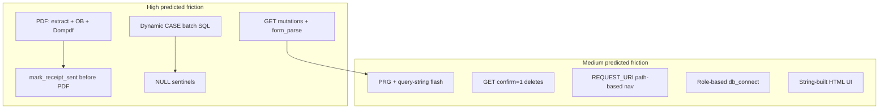

# PHP migration friction — predicted hiccups

**Source:** `original-immutable/silent_auction_merged/`

**Purpose:** Pre-migration baseline — predicted constructs where AI-assisted migration is likely to struggle. Compare against actual outcomes in later phases; differences may vary by methodology.

**Scope:** Same as [feature-inventory.md](./feature-inventory.md) — end-user functional behavior. PHPUnit suite out of scope.

**Related docs:** [feature-inventory.md](./feature-inventory.md) · [data model relationships](./data-model-documentation/relationships.md)

**Difficulty:** **H** = high · **M** = medium · **L** = low

---

## Executive summary

The app is a **procedural PHP 8+ monolith**: one script per route, manual `include`/`require_once` composition, PDO with hand-written SQL, string-built HTML, and Dompdf for PDFs. There is no framework, no ORM, no session layer, and no authentication.

Straight CRUD and read-only list pages are likely to migrate cleanly. Predicted friction concentrates in **implicit conventions** — GET mutations, sentinel values, side-effect ordering, dynamic SQL, output buffering around PDFs, and navigation derived from `REQUEST_URI`.

---

## 1. Negative findings

Constructs commonly assumed in PHP migrations but **absent** in this codebase. Predicting friction here would be a false positive.

| Construct                                       | Status                                                               |
| ----------------------------------------------- | -------------------------------------------------------------------- |
| Session handling (`session_start`, `$_SESSION`) | **Absent** — stateless request/response only                         |
| Framework routing, middleware, DI container     | **Absent** — explicit includes per entry script                      |
| ORM / query builder                             | **Absent** — raw PDO prepared statements                             |
| Production Composer autoload                    | **Absent** — dev-only autoload for PHPUnit                           |
| Heavy global mutable state                      | **Minimal** — `global` only in `data/db_connect.php` for config vars |

---

## 2. Predicted friction points

### High

#### MF-01 — GET-based form mutations

| Field            | Detail                                                                                                                                                                                        |
| ---------------- | --------------------------------------------------------------------------------------------------------------------------------------------------------------------------------------------- |
| **Evidence**     | All create/edit forms use `method='get'` (`includes/ui/form_*.php`). Submission detected via `form_was_submitted()` and `parse_form_get()` reading `$_GET` (`includes/utils/form_parse.php`). |
| **Features**     | S6, D2, D3, I3, I4, L2, L3, C2, C3                                                                                                                                                            |
| **Failure mode** | AI switches to POST without updating submit detection; forms never save or redirect logic breaks.                                                                                             |

#### MF-02 — Dynamic `CASE` batch SQL (`modify_items`)

| Field            | Detail                                                                                                                                                                                                         |
| ---------------- | -------------------------------------------------------------------------------------------------------------------------------------------------------------------------------------------------------------- |
| **Evidence**     | `data/db_items.php` builds runtime `UPDATE ... SET LotID = CASE ... END WHERE ItemID IN (...)` with dynamic placeholders. `LotID = -1` maps to SQL `NULL`. Caller in `lots/items.php` only posts changed rows. |
| **Features**     | I2                                                                                                                                                                                                             |
| **Failure mode** | ORM replaces with N individual updates or simpler pattern; `-1` sentinel mishandled; batch semantics or diff-only behavior lost.                                                                               |

#### MF-03 — PDF pipeline (`extract`, output buffering, Dompdf)

| Field            | Detail                                                                                                                                                                                                                                                                                                |
| ---------------- | ----------------------------------------------------------------------------------------------------------------------------------------------------------------------------------------------------------------------------------------------------------------------------------------------------- |
| **Evidence**     | `includes/utils/pdf.php`: `render_template_to_html()` uses `extract()` + `include` + `ob_start`; `stream_pdf()` clears buffers, sets binary headers, `echo $pdf`, `exit`. Print handlers (`donors/letters_print.php`, `donors/receipts_print.php`, `lots/bidding_sheet.php`) start with `ob_start()`. |
| **Features**     | D8, D10, I6, P4                                                                                                                                                                                                                                                                                       |
| **Failure mode** | Blank PDFs, "headers already sent", broken template variable scope, layout drift under Dompdf CSS subset.                                                                                                                                                                                             |

#### MF-04 — Receipt side-effect before PDF stream

| Field            | Detail                                                                                                           |
| ---------------- | ---------------------------------------------------------------------------------------------------------------- |
| **Evidence**     | `donors/receipts_print.php` calls `mark_receipt_sent($donorId)` inside the donor loop **before** `stream_pdf()`. |
| **Features**     | D10                                                                                                              |
| **Failure mode** | AI marks receipt sent only after successful PDF generation; behavioral parity breaks on partial failure paths.   |

#### MF-05 — NULL and checkbox sentinel encoding

| Field            | Detail                                                                                                                                                                                                                                                                                                                                                                                                      |
| ---------------- | ----------------------------------------------------------------------------------------------------------------------------------------------------------------------------------------------------------------------------------------------------------------------------------------------------------------------------------------------------------------------------------------------------------- |
| **Evidence**     | Lot select UI uses `'NULL'` string (`includes/ui/form_items.php`). Bulk update uses integer `-1` → SQL `NULL` (`data/db_items.php`). Lot persistence maps empty/`"NULL"` strings to `PDO::PARAM_NULL` (`data/db_lots.php`). Checkboxes use hidden `off` + checked `on`; DB maps `"on"` → `"1"` — with a documented TODO in `includes/ui/form_field.php`. Form field `HighestBid` vs DB column `WinningBid`. |
| **Features**     | I2, I3, I4, L2, L3, D3                                                                                                                                                                                                                                                                                                                                                                                      |
| **Failure mode** | Typed models normalize sentinels away; silent NULL vs 0 vs unset bugs; checkbox state wrong on edit.                                                                                                                                                                                                                                                                                                        |

### Medium

#### MF-06 — PRG + query-string flash messages

| Field            | Detail                                                                                                                                                        |
| ---------------- | ------------------------------------------------------------------------------------------------------------------------------------------------------------- |
| **Evidence**     | Dozens of `header('Location: ...?success=' / '?error=')` call sites. `includes/flash_messages.php` maps query codes to user-facing strings. No session flash. |
| **Features**     | S4, D2–D4, I1–I5, L1–L4, C1–C4, D7, D9                                                                                                                        |
| **Failure mode** | Toast/session flash replaces redirects but wrong message codes or missing redirect targets.                                                                   |

#### MF-07 — GET delete confirmation (`confirm=1`)

| Field            | Detail                                                                                                                                                                                                          |
| ---------------- | --------------------------------------------------------------------------------------------------------------------------------------------------------------------------------------------------------------- |
| **Evidence**     | `lots/delete_lot.php`, `delete_item.php`, `delete_category.php`, `donors/delete_donor.php` — destructive action via second GET with `?confirm=1`. `includes/ui/confirm_delete.php` renders link to confirm URL. |
| **Features**     | D4, I5, L4, C4, S8                                                                                                                                                                                              |
| **Failure mode** | AI "fixes" to POST + CSRF; delete flow broken or behavior changed without explicit parity constraint.                                                                                                           |

#### MF-08 — `REQUEST_URI` path-based navigation

| Field            | Detail                                                                                                                                                                                              |
| ---------------- | --------------------------------------------------------------------------------------------------------------------------------------------------------------------------------------------------- |
| **Evidence**     | `includes/header.php` parses `$_SERVER['REQUEST_URI']` for active main nav. `includes/lots_subnav.php` uses filename `switch` on last path segment and reads `$_GET` for contextual delete buttons. |
| **Features**     | S3, L6, D5                                                                                                                                                                                          |
| **Failure mode** | Active tab wrong under different URL schemes; contextual actions missing when `BASE_URL` or routing changes.                                                                                        |

#### MF-09 — Role-based PDO credentials

| Field            | Detail                                                                                                                                  |
| ---------------- | --------------------------------------------------------------------------------------------------------------------------------------- |
| **Evidence**     | `data/db_connect.php` selects RO/RW/FC credentials via `global` config vars; each `db_*.php` function passes `'ro'` or `'rw'` per call. |
| **Features**     | P2, P3                                                                                                                                  |
| **Failure mode** | Single DB user in target stack widens write access or breaks read-only pages.                                                           |

#### MF-10 — String-built HTML UI

| Field            | Detail                                                                                                                                                                                                                        |
| ---------------- | ----------------------------------------------------------------------------------------------------------------------------------------------------------------------------------------------------------------------------- |
| **Evidence**     | UI rendered via concatenated HTML in `includes/ui/*` functions. PDF templates alone use `<?= ?>` (`templates/`, `utils/bidding_sheet.php`). Detached submit button uses `form="items-lot-form"` (`includes/lots_subnav.php`). |
| **Features**     | S2, S8, I1, I2, L1, D1                                                                                                                                                                                                        |
| **Failure mode** | Component framework migration drifts CSS classes, form `name` attributes, or cross-form submit wiring.                                                                                                                        |

#### MF-11 — `stdClass` form bags and associative DB rows

| Field            | Detail                                                                                                                                                                                                                                                               |
| ---------------- | -------------------------------------------------------------------------------------------------------------------------------------------------------------------------------------------------------------------------------------------------------------------- |
| **Evidence**     | Forms use `(object)[]` with dynamic properties (`$values->description`, `$errors->highest_bid`). DB returns `PDO::FETCH_ASSOC` with SQL aliases (`LotDescription`, `WinningBidder`). Auction groups items via `$auction_dict->{$category_id}` (`auction/index.php`). |
| **Features**     | A1, L2, L3, S6                                                                                                                                                                                                                                                       |
| **Failure mode** | Renamed properties, dropped optional fields, or alias mismatches between SQL, forms, and display.                                                                                                                                                                    |

#### MF-12 — Split queries and inconsistent error handling

| Field            | Detail                                                                                                                                                                                              |
| ---------------- | --------------------------------------------------------------------------------------------------------------------------------------------------------------------------------------------------- |
| **Evidence**     | `get_items()` runs two queries (NULL lot, then non-NULL lot) and merges (`data/db_items.php`). Many `db_*.php` functions `echo` errors and return `false`; callers mix try/catch and return checks. |
| **Features**     | I1, P3                                                                                                                                                                                              |
| **Failure mode** | Single-query "improvement" changes list order; exception-based stacks surface different partial-render failures.                                                                                    |

### Low

#### MF-13 — Straight prepared-statement CRUD

| Field            | Detail                                                                                          |
| ---------------- | ----------------------------------------------------------------------------------------------- |
| **Evidence**     | `db_donors.php`, `db_categories.php`, most of `db_lots.php` — static SQL with bound parameters. |
| **Features**     | D1–D3, C1–C3, L1                                                                                |
| **Failure mode** | Low risk; column name typos possible.                                                           |

#### MF-14 — Formatting and layout helpers

| Field            | Detail                                                                     |
| ---------------- | -------------------------------------------------------------------------- |
| **Evidence**     | `includes/utils/format.php`, `includes/page_layout.php`, `css/global.css`. |
| **Features**     | S7, S2, S5                                                                 |
| **Failure mode** | Cosmetic drift; unlikely functional regression.                            |

---

## 3. Prediction scorecard

Use in Phase 2+ to compare prediction vs reality. Fill **Actual issue?** and **Notes** during migration experiments.

| MF-ID | Construct                   | Difficulty | Feature IDs                        | Predicted?  | Actual issue? | Notes |
| ----- | --------------------------- | ---------- | ---------------------------------- | ----------- | ------------- | ----- |
| MF-01 | GET-based form mutations    | H          | S6, D2, D3, I3, I4, L2, L3, C2, C3 | Yes         |               |       |
| MF-02 | Dynamic `CASE` batch SQL    | H          | I2                                 | Yes         |               |       |
| MF-03 | PDF pipeline                | H          | D8, D10, I6, P4                    | Yes         |               |       |
| MF-04 | Receipt side-effect order   | H          | D10                                | Yes         |               |       |
| MF-05 | NULL/checkbox sentinels     | H          | I2, I3, I4, L2, L3, D3             | Yes         |               |       |
| MF-06 | PRG + query-string flash    | M          | S4, most write features            | Yes         |               |       |
| MF-07 | GET delete confirmation     | M          | D4, I5, L4, C4                     | Yes         |               |       |
| MF-08 | `REQUEST_URI` navigation    | M          | S3, L6, D5                         | Yes         |               |       |
| MF-09 | Role-based PDO credentials  | M          | P2, P3                             | Yes         |               |       |
| MF-10 | String-built HTML UI        | M          | S2, S8, I1, I2                     | Yes         |               |       |
| MF-11 | stdClass / FETCH_ASSOC bags | M          | A1, L2, L3, S6                     | Yes         |               |       |
| MF-12 | Split queries / error echo  | M          | I1, P3                             | Yes         |               |       |
| MF-13 | Straight CRUD SQL           | L          | D1–D3, C1–C3, L1                   | Yes         |               |       |
| MF-14 | Formatting helpers          | L          | S7, S2, S5                         | Yes         |               |       |
| —     | Session handling            | N/A        | —                                  | No (absent) |               |       |

**H-rated features coverage:** D8 → MF-03 · D10 → MF-03, MF-04 · I2 → MF-02, MF-05 · I6 → MF-03

---

## 4. Methodology-sensitive hypotheses

How predictions may differ by migration approach (analytical only — not implementation guidance):

| Approach               | Likely early friction                                                      | Likely late / missed friction                         |
| ---------------------- | -------------------------------------------------------------------------- | ----------------------------------------------------- |
| **Page-by-page port**  | MF-01, MF-06, MF-08 — forms, flash, nav break before data layer            | MF-02, MF-04 — batch SQL and side-effect order        |
| **Framework scaffold** | MF-07, MF-01 — AI "fixes" GET writes/deletes and changes behavior          | MF-05 — sentinels hidden behind ORM defaults          |
| **ORM-first**          | MF-02, MF-05 — batch semantics and sentinel encoding                       | MF-03 — PDF layout passes logic tests but looks wrong |
| **Test-driven**        | MF-04, MF-05 — receipt order and NULL encoding caught by integration tests | MF-03 — visual PDF regression                         |

---

## 5. Out-of-scope / stub caveat

**Bidders (X1):** `bidders/index.php` is a stub ("not yet implemented"), but `get_bidders()` feeds the winning-bidder select on lot forms (L2, L3). Migration should preserve read-only bidder consumption and **not** invent bidder CRUD unless scope explicitly expands.

**Duplicate accessors:** `get_categories()` exists in both `data/db_lots.php` and `data/db_categories.php` — consolidation is a migration choice, not a user-facing feature change.

---

## 6. Evidence index

| File                                                 | Relevant constructs |
| ---------------------------------------------------- | ------------------- |
| `includes/utils/form_parse.php`                      | MF-01               |
| `includes/ui/form_lots.php` (and siblings)           | MF-01               |
| `data/db_items.php` (`modify_items`, `get_items`)    | MF-02, MF-12        |
| `lots/items.php`                                     | MF-02, MF-06        |
| `includes/utils/pdf.php`                             | MF-03               |
| `donors/receipts_print.php`                          | MF-03, MF-04        |
| `donors/letters_print.php`, `lots/bidding_sheet.php` | MF-03               |
| `data/db_lots.php`                                   | MF-05               |
| `includes/ui/form_field.php`                         | MF-05               |
| `includes/flash_messages.php`                        | MF-06               |
| `lots/delete_lot.php` (and siblings)                 | MF-07               |
| `includes/header.php`, `includes/lots_subnav.php`    | MF-08               |
| `data/db_connect.php`                                | MF-09               |
| `includes/ui/*`                                      | MF-10               |
| `auction/index.php`                                  | MF-11               |
